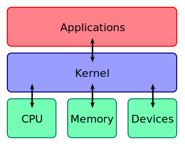
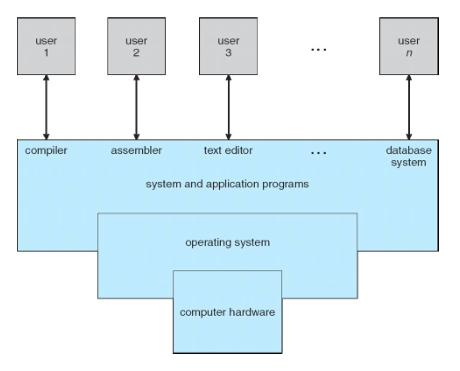
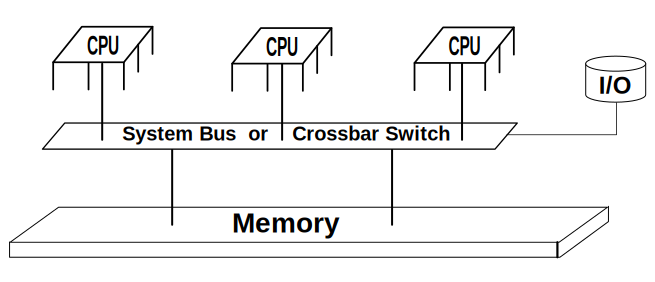
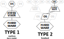

# 운영체제 1장 개관

> Abraham Silberschatz, Peter B. Galvin, Greg Gagne의 『Operating System Concepts 9th』 1장과  
> [공룡책으로 정리하는 운영체제 - CHAPTER 1](https://blog.naver.com/bisu1532/221597987136)을 기준으로 정리했습니다.

1장은 운영체제 전반을 훑는 개요 장입니다. 뒤에서 자세히 배울 프로세스, 메모리, 저장장치, 입출력, 보호와 보안 같은 주제를 한 번씩 소개합니다. 처음 읽을 때는 세부 구현보다 운영체제가 어떤 문제를 해결하려고 등장했는지 보는 것이 중요합니다.

## 1. 운영체제의 역할

운영체제는 컴퓨터 하드웨어를 관리하는 프로그램입니다. 응용 프로그램이 실행될 수 있는 기반을 제공하고, 사용자와 컴퓨터 하드웨어 사이에서 중재자 역할을 합니다.

운영체제의 핵심인 커널은 응용 프로그램과 하드웨어 사이에 위치합니다. 응용 프로그램은 하드웨어를 직접 다루기보다 커널을 통해 CPU, 메모리, 장치 같은 자원을 사용합니다.

운영체제의 설계 목표는 시스템의 종류에 따라 달라집니다.

- 대형 컴퓨터의 운영체제는 하드웨어 이용을 최적화하는 데 중점을 둡니다.
- 개인용 컴퓨터의 운영체제는 게임, 업무 프로그램 같은 응용 프로그램 지원과 사용 편의성을 중시합니다.
- 휴대용 컴퓨터의 운영체제는 사용자가 장치와 쉽게 상호작용할 수 있는 환경을 제공하는 데 중점을 둡니다.

## 2. 컴퓨터 시스템과 운영체제 관점

컴퓨터 시스템은 크게 하드웨어, 운영체제, 응용 프로그램, 사용자로 나눌 수 있습니다.

하드웨어는 CPU, 메모리, 입출력 장치처럼 계산에 필요한 기본 자원을 제공합니다. 운영체제는 여러 응용 프로그램이 이 자원을 어떻게 사용할지 제어하고 조정합니다.

운영체제는 관점에 따라 다르게 설명할 수 있습니다.

- **사용자 관점**: 사용자가 어떤 인터페이스로 컴퓨터를 쓰는지에 따라 운영체제의 역할이 달라집니다. 개인용 컴퓨터에서는 사용 편의성이 중요하고, 여러 사용자가 하나의 대형 컴퓨터를 공유하는 환경에서는 자원 이용률과 공정성이 중요합니다.
- **시스템 관점**: 운영체제는 CPU 시간, 메모리 공간, 저장장치, 입출력 장치 같은 자원을 관리하는 **자원 할당자**입니다. 동시에 사용자 프로그램이 시스템을 잘못 사용하지 않도록 제어하는 **제어 프로그램**이기도 합니다.

운영체제를 완벽하게 정의하기는 어렵지만, 일반적으로 컴퓨터에서 항상 실행되는 핵심 프로그램을 **커널**이라고 부릅니다.

## 3. 컴퓨터 시스템 구성과 인터럽트

현대의 범용 컴퓨터 시스템은 하나 이상의 CPU와 여러 장치 제어기가 공통 버스로 연결되어 메모리를 공유하는 구조입니다.

컴퓨터가 켜지면 ROM이나 EEPROM에 저장된 **부트스트랩 프로그램**이 실행됩니다. 이 프로그램은 시스템을 초기화하고, 운영체제 커널을 찾아 메모리에 적재한 뒤 실행을 시작합니다. UNIX 계열에서는 초기화 과정 뒤 첫 시스템 프로세스인 `init`이 실행됩니다.

부팅이 끝난 시스템은 사건이 발생하기를 기다립니다. 사건은 주로 **인터럽트**로 전달됩니다.

- 하드웨어는 시스템 버스를 통해 CPU에 인터럽트를 보낼 수 있습니다.
- 소프트웨어는 **시스템 콜**을 통해 인터럽트를 발생시킬 수 있습니다.
- CPU가 인터럽트를 받으면 현재 작업을 멈추고, 인터럽트 서비스 루틴을 실행한 뒤 원래 작업으로 돌아갑니다.

인터럽트 구조에서는 중단된 명령의 주소와 상태를 저장했다가, 처리가 끝난 뒤 복원하는 과정이 중요합니다.

## 4. 저장장치 구조와 입출력

CPU는 명령어를 메모리에서만 가져올 수 있으므로, 프로그램이 실행되려면 반드시 메인 메모리에 올라와 있어야 합니다. 주 메모리인 RAM은 빠르지만 용량이 제한적이고, 전원이 꺼지면 내용이 사라지는 휘발성 저장장치입니다.

이 한계를 보완하기 위해 대부분의 컴퓨터 시스템은 보조 저장장치를 사용합니다. 보조 저장장치는 대량의 데이터를 오래 보존할 수 있어야 하며, 저장장치들은 속도, 가격, 크기, 휘발성 여부에 따라 구분됩니다.

입출력은 운영체제에서 큰 비중을 차지합니다. 장치마다 특성이 다르기 때문에 운영체제는 장치 드라이버를 통해 장치를 제어합니다. 적은 양의 데이터는 인터럽트 방식으로 처리할 수 있지만, 디스크 입출력처럼 큰 데이터를 옮길 때는 CPU 부담이 커질 수 있습니다.

이를 줄이기 위해 **DMA**(Direct Memory Access)를 사용합니다. DMA는 CPU가 매 바이트마다 개입하지 않아도 장치와 메모리 사이에서 데이터 블록을 직접 전송하게 해줍니다. CPU는 전송이 끝났을 때 인터럽트로 완료 사실만 전달받습니다.

## 5. 컴퓨터 시스템 구조

컴퓨터 시스템 구조는 처리기 구성 방식에 따라 나눌 수 있습니다.

### 단일 처리기 시스템

단일 처리기 시스템은 사용자 명령어를 실행할 수 있는 하나의 주 CPU를 가집니다. 다만 디스크, 키보드, 그래픽 장치처럼 특정 작업을 맡는 전용 처리기를 함께 가질 수 있습니다.

### 다중 처리기 시스템

다중 처리기 시스템은 둘 이상의 처리기를 가지며, 버스, 메모리, 주변 장치를 공유합니다. 장점은 다음과 같습니다.

- 처리기가 늘어나 더 많은 일을 짧은 시간에 처리할 수 있습니다.
- 여러 단일 시스템을 따로 두는 것보다 주변 장치와 저장장치를 공유할 수 있어 비용을 줄일 수 있습니다.
- 한 처리기에 문제가 생겨도 시스템 전체가 바로 멈추지 않아 신뢰성이 높아집니다.

다중 처리 방식에는 비대칭 방식과 대칭 방식이 있습니다. 비대칭 방식은 주 처리기가 다른 처리기들을 제어합니다. 대칭적 다중 처리(SMP)는 모든 처리기가 대등하게 운영체제 작업을 수행하며, 각 처리기는 자신의 레지스터와 캐시를 가지지만 메모리는 공유합니다.

최근에는 하나의 칩에 여러 코어를 넣는 **멀티코어** 구조가 일반적입니다. 칩 내부 통신이 칩 사이 통신보다 빠르기 때문에 효율적입니다.

### 클러스터형 시스템

클러스터형 시스템은 둘 이상의 독립적인 시스템 또는 노드를 연결해 구성합니다. 다중 처리기 시스템보다 느슨하게 결합된 구조이며, 주로 높은 가용성을 위해 사용됩니다.

- 비대칭 클러스터링에서는 한 노드가 대기 상태로 있다가 활성 서버가 고장 나면 대신 동작합니다.
- 대칭 클러스터링에서는 둘 이상의 노드가 동시에 응용 프로그램을 실행하면서 서로를 감시합니다.

## 6. 운영체제 구조와 연산

운영체제의 중요한 특징 중 하나는 **다중 프로그래밍**입니다. 한 사용자가 CPU와 입출력 장치를 항상 바쁘게 유지하기는 어렵기 때문에, 운영체제는 여러 작업을 메모리에 올려두고 CPU가 실행할 작업을 계속 찾도록 합니다. 이를 통해 CPU 이용률을 높일 수 있습니다.

**시분할** 또는 **멀티태스킹**은 다중 프로그래밍의 확장입니다. CPU가 여러 작업을 빠르게 번갈아 실행하므로, 사용자는 각 프로그램이 동시에 실행되는 것처럼 느낍니다.

이 과정에서 운영체제는 다음 결정을 내려야 합니다.

- 어떤 작업을 메모리에 올릴지 정하는 작업 스케줄링
- 실행 가능한 작업 중 어떤 작업에 CPU를 줄지 정하는 CPU 스케줄링
- 메모리가 부족할 때 프로세스를 디스크와 메모리 사이에서 옮기는 스와핑
- 프로그램 일부만 메모리에 있어도 실행할 수 있게 하는 가상 메모리

현대 운영체제는 기본적으로 인터럽트 기반으로 동작합니다. 실행할 프로세스도 없고, 처리할 입출력도 없고, 응답할 사용자도 없다면 운영체제는 기다립니다.

### 이중 모드와 타이머

운영체제는 사용자 프로그램이 시스템을 망가뜨리지 못하도록 **사용자 모드**와 **커널 모드**를 구분합니다. 일반 응용 프로그램은 사용자 모드에서 실행되고, 운영체제 서비스가 필요하면 시스템 콜을 통해 커널 모드로 전환합니다.

특권 명령은 커널 모드에서만 실행할 수 있습니다. 이를 통해 잘못된 사용자 프로그램으로부터 운영체제와 다른 사용자를 보호합니다.

**타이머**는 운영체제가 CPU 제어권을 잃지 않도록 돕습니다. 사용자 프로그램이 무한 루프에 빠지거나 운영체제에 제어권을 돌려주지 않는 상황을 막기 위해, 일정 시간이 지나면 인터럽트를 발생시켜 운영체제가 다시 제어권을 얻습니다.

## 7. 프로세스와 메모리 관리

**프로세스**는 실행 중인 프로그램입니다. 프로그램은 디스크에 저장된 수동적인 존재이고, 프로세스는 프로그램 카운터를 가진 능동적인 존재입니다.

프로세스는 자신의 일을 수행하기 위해 CPU 시간, 메모리, 파일, 입출력 장치를 필요로 합니다. 운영체제는 프로세스 관리와 관련해 다음 일을 담당합니다.

- 프로세스와 스레드를 CPU에 스케줄링합니다.
- 사용자 프로세스와 시스템 프로세스를 생성하고 제거합니다.
- 프로세스를 일시 중지하거나 다시 실행합니다.
- 프로세스 동기화와 프로세스 간 통신 기법을 제공합니다.

메인 메모리는 CPU와 입출력 장치가 공유하는 빠른 저장소입니다. 프로그램이 실행되려면 메모리에 적재되어야 하고, 실행 중에는 명령어와 데이터가 메모리 주소를 통해 접근됩니다.

운영체제는 메모리 관리를 위해 현재 어떤 메모리 영역이 누구에게 사용되는지 추적하고, 어떤 프로세스를 메모리에 올리거나 제거할지 결정하며, 필요에 따라 메모리 공간을 할당하고 회수합니다.

## 8. 저장장치 관리와 캐싱

운영체제는 저장장치를 사용자가 다루기 쉬운 형태로 추상화합니다. 대표적인 추상화가 **파일**입니다. 파일은 관련 정보의 집합이며, 운영체제는 파일 생성, 삭제, 디렉터리 관리, 파일과 보조 저장장치의 매핑, 백업 등을 담당합니다.

대용량 저장장치 관리에서는 자유 공간 관리, 저장 공간 할당, 디스크 스케줄링이 중요합니다.

**캐싱**은 느린 저장장치의 정보를 더 빠른 저장장치에 임시로 복사해두는 기법입니다. 필요한 정보가 캐시에 있으면 빠르게 사용할 수 있고, 없으면 원래 저장장치에서 가져옵니다.

다중 처리기 환경에서는 같은 데이터의 복사본이 여러 CPU의 캐시에 동시에 존재할 수 있습니다. 이때 한 캐시의 값이 바뀌면 다른 캐시에도 그 변경이 반영되어야 하는데, 이를 **캐시 일관성** 문제라고 합니다.

입출력 시스템은 장치의 세부 특성을 사용자에게 숨기는 역할을 합니다. 운영체제는 버퍼링, 캐싱, 스풀링, 장치 드라이버 인터페이스, 실제 장치 드라이버를 통해 입출력을 관리합니다.

## 9. 보호와 보안

여러 사용자가 하나의 시스템을 공유하고 여러 프로세스가 병렬로 실행된다면, 데이터와 자원 접근은 반드시 통제되어야 합니다.

운영체제는 적절한 권한을 가진 프로세스만 파일, 메모리, CPU, 입출력 장치 같은 자원에 접근하도록 해야 합니다. 예를 들어 메모리 주소 지정 하드웨어는 프로세스가 자신의 주소 공간 안에서만 실행되도록 돕고, 타이머는 한 프로세스가 CPU를 계속 독점하지 못하게 합니다.

**보호**는 시스템 자원에 대한 프로세스와 사용자의 접근을 제어하는 기법입니다. **보안**은 외부 또는 내부 공격으로부터 시스템을 방어하는 기법입니다.

## 10. 커널 자료구조

커널 내부에서는 여러 기본 자료구조가 사용됩니다.

- **리스트, 스택, 큐**: 작업 순서나 대기 중인 항목을 관리할 때 사용됩니다.
- **트리**: 계층 구조를 표현하고 탐색을 효율적으로 수행할 때 사용됩니다.
- **해시맵**: 키와 값을 연결해 빠르게 찾을 때 사용됩니다. 다만 해시 충돌이 많아지면 효율이 떨어집니다.
- **비트맵**: 여러 항목의 사용 여부나 상태를 비트 단위로 표현할 때 사용됩니다.

## 11. 계산 환경과 오픈소스 운영체제

전통적인 계산 환경의 경계는 점점 흐려지고 있습니다. 모바일 컴퓨팅은 스마트폰과 태블릿처럼 휴대용 장치에서 이루어지는 계산을 뜻합니다. 분산 시스템은 물리적으로 떨어져 있는 컴퓨터들이 네트워크로 연결되어 자원을 공유하는 구조입니다.

**가상화**는 하나의 운영체제가 다른 운영체제 안에서 응용 프로그램처럼 실행될 수 있게 합니다. **클라우드 컴퓨팅**은 계산, 저장장치, 응용 프로그램을 네트워크를 통해 서비스 형태로 제공하는 방식입니다.

+ 오픈소스 운영체제는 컴파일된 바이너리 코드가 아니라 소스 코드 형태로 제공되는 운영체제입니다. 대표적인 예로 Linux, Solaris, BSD UNIX 등이 있습니다.
