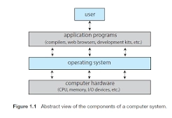
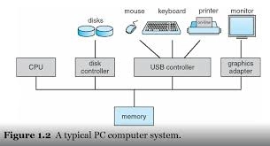
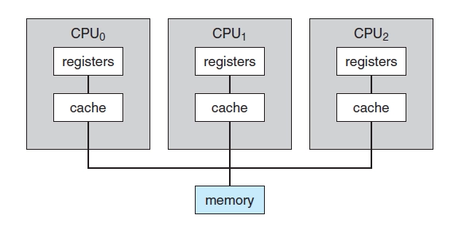
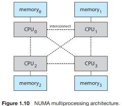
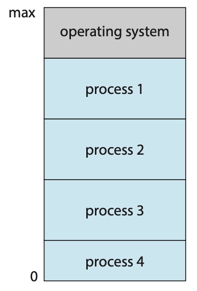

운영체제는 컴퓨터 하드웨어를 관리하는 소프트웨어이다. 운영체제는 또한 응용 프로그램을 위한 기반을 제공하며 컴퓨터 사용자와 컴퓨터 하드웨어 사이에서 중재자 역할을 수행한다.

운영체제의 근본적인 책임은 컴퓨터 하드웨어 자원들을 프로그램에 할당하는 것이다.

<aside>

이 장의 목표

- 컴퓨터 시스템의 일반적인 구성과 인터럽트의 역할을 기술한다.
- 현대 다중 처리기 컴퓨터 시스템의 구성요소에 관해 기술한다.
- 사용자 모드에서 커널 모드로의 전환에 대해 설명한다.
- 다양한 컴퓨팅 환경에서 운영체제가 어떻게 사용되는지 논의한다.
- 무료 및 공개 운영체제의 예를 제공한다.
</aside>

## 1.1 운영체제가 할 일(what operating system do)

컴퓨터 시스템 = 하드웨어 + 운영체제 + 응용프로그램 + 사용자

운영체제는 다양한 사용자를 위해 다양한 응용 프로그램 간의 하드웨어 사용을 제어하고 조정한다.

운영체제는 ‘정부’와 같다. 그 자체로는 유용한 기능을 수행하지 못한다. 단순히 다른 프로그램이 유용한 작업을 수행할 수 있는 환경을 제공한다.

### 1.1.1 사용자 관점(User View)

운영체제는 대부분 사용의 용이성을 위해 설계되고 성능에 약간 신경을 쓰고 다양한 하드웨어와 소프트웨어 자원이 어떻게 공유되느냐의 자원의 이용에는 전혀 신경을 쓰지 않는다.

터치스크린, 시리 등의 다양한 인터페이스들..

### 1.1.2 시스템 관점(System View)

우리는 운영체제를 자원 할당자(resource allocator)로 볼 수 있다. 컴퓨터 시스템은 문제를 해결하기 위한 자원들(hw, sw)을 가진다. 운영체제는 이들의 관리자로 작동한다.

운영체제는 제어 프로그램(control program)이다. 제어 프로그램은 컴퓨터의 부적절한 사용을 방지하기 위해 사용자 프로그램의 수행을 ‘제어’한다.

### 1.1.3 운영체제의 정의

컴퓨팅은 처음 무엇을 할 수 있을지 알기 위한 실험으로 시작했으나 군사, 정부 업무등의 고정 목적 시스템으로 전용되었다.

`무어의 법칙`이 집적회로의 트랜지스터 수가 18개월마다 배가할 것이라고 예측했다. 이 법칙은 지켜져 왔다. 컴퓨터는 기능이 확대되고 크기가 작아졌으며 용도가 다양해졌고 다양한 운영체제가 등장했다.

운영체제는 유용한 컴퓨팅 시스템을 만드는 문제를 해결할 수 있는 합리적인 방법을 제공하기 때문에 존재한다.

<aside>

왜 운영체제를 공부하는가?

→ 컴퓨터 과학에 종사하는 사람은 많지만 운영체제를 만들거나 수정하는 데는 소수만이 참여한다. 운영체제 작동방식에 대한 지식은 적절하고 효율적이며 효과적이며 안전한 프로그래밍에 중요하기 때문이다.
운영체제의 기본 지식, 컴퓨터 하드웨어 구동 방식 및 응용 프로그램에 제공하는 내용을 이해하는 것은 프로그램을 작성하고 운영체제를 사용하는 사람들에게 매우 유용하다.

</aside>

## 1.2 컴퓨터 시스템의 구성(computer-System Organization)

현대 범용 컴퓨터 시스템은 CPU와 구성요소와 메모리 사이 연결을 버스를 통해 구성된다.

일반적으로 운영체제에는 각 장치 컨트롤러마다 장치 드라이버가 있다. 이 장치 드라이버는 장치 컨트롤러의 작동을 잘 알고 있고 나머지 운영체제에 장치에 대한 일관된 인터페이스를 제공한다.

CPU와 장치 컨트롤러는 병렬로 실행되어 메모리 사이클을 놓고 경쟁한다.

### 1.2.1 인터럽트(Interrupts)

컨트롤러는 장치 드라이버에게 작업을 완료했다는 사실을 어떻게 알릴까? 이는 인터럽트를 통해 이루어진다.

#### 1.2.1.1 개요_overview

하드웨어는 어느 순간이든 시스템 버스를 통해 CPU에 신호를 통해 인터럽트를 발생시킬 수 있다.(외부 장치는 물리적으로 **"급한 일이 생겼다"는 전기적 신호(IRQ)**만 보냅니다.)

**인터럽트는 운영체제와 하드웨어의 상호 작용 방식의 핵심 부분이다.**

CPU가 인터럽트 되면, CPU는 하던 일을 중단하고 즉시 고정된 위치로 실행을 옮긴다. 고정된 위치는 일반적으로 인터럽트를 위한 서비스 루틴이 위치한 시작 주소를 가지고 있다. 그리고 인터럽트 서비스 루틴이 실행된다. 인터럽트 서비스 루틴이 완료되면, CPU는 인터럽트 되었던 연산을 재개한다.

인터럽트 구조는 또한 인터럽트된 모든 정보를 저장해야 인터럽트를 처리한 후 이 정보를 복원할 수 있다. 인터럽트를 서비스한 후, 저장되어 있던 복귀 주소를 프로그램 카운터에 적재하고, 인터럽트에 의해 중단되었던 연산이 인터럽트가 발생되지 않았던 것처럼 다시 시작된다.

#### 1.2.1.2 구현(implementation)

기본 인터럽트 매커니즘은 다음과 같이 동작한다.

CPU 에는 인터럽트 요청 라인이라는 선이 있는데, 이는 하나의 명령어의 실행을 완료할 때마다 CPU가 이 선을 감지한다. CPU가 받은 신호를 감지하면, 인터럽트 번호를 읽고 이 번호를 인터럽트 벡터의 인덱스로 사용하여 인터럽트 핸들러 루틴으로 점프한다.

> 인터럽트 핸들러 루틴:
>
>
> **인터럽트가 발생했을 때 그걸 처리하려고 OS가 실행하는 함수**예요.
>
> "키보드 눌렸다 / 디스크 다 읽었다" 같은 신호가 오면, 하던 일 잠깐 멈추고 → 그 신호에 맞는 처리 함수 실행하고 → 다시 원래 하던 일로 돌아가는데, 그 **"처리 함수"가 인터럽트 핸들러 루틴**
>

### 1.2.2 저장장치 구조(Storage Structure)

CPU는 메모리에서만 명령을 적재할 수 있으므로 실행하려면 프로그램을 먼저 메모리에 적재해야 한다. 범용 컴퓨터는 프로그램 대부분을 메인 메모리(RAM, random access memory)라 불리는 재기록 가능한 메모리에서 가져온다.

이상적으로는, 프로그램과 데이터가 메인 메모리에 영원히 존재하기를 원한다. 그러나 이는 대부분의 시스템에서 두 가지 이유로 불가능하다.

1. 메인 메모리는 모든 필요한 프로그램과 데이터를 영구히 저장하기에는 너무 작다.
2. 메인 메모리는 이미 언급한 것처럼 전원이 공급되지 않으면 그 내용을 잃어버리는 휘발성 저장장치다.

그러므로 대부분의 컴퓨터 시스템은 메인 메모리의 확장으로 보조저장장치를 제공한다.

### 1.2.3 입출력 구조(I/O Structure)

운영체제 코드의 상당 부분은 시스템의 안정성과 성능에 대한 중요성과 장치의 다양한 특성으로 인해 I/O 관리에 할애된다.

인터럽트 구동 I/O의 형태는 소량 데이터를 이동하는데는 좋지만 대량 데이터 이동에 사용될 때 높은 오버헤드를 유발할 수 있다. 이 문제를 해결하기 위해 직접 메모리 액세스(DMA)가 사용된다.

## 1.3 컴퓨터 시스템 구조(Computer-System Architecture)

컴퓨터 시스템은 사용된 범용 처리기의 수에 따라 분류 가능한 다양한 방식으로 구성될 수 있다.

### 1.3.1 단일 처리기 시스템(Single-Processor Systems)

코어는 명령을 실행하고 로컬로 데이터를 저장하기 위한 레지스터를 포함하는 구성요소이다. 코어를 가진 하나의 메인 CPU는 프로세스의 명령어를 포함하여 범용 명령어 세트를 실행할 수 있다.

단일 처리 코어를 가진 범용 CPU가 하나만 있는 경우 시스템은 단일 프로세서 시스템이다.

### 1.3.2 다중 처리기 시스템(Multiprocessor System)

최신의 컴퓨터, 모바일 장치는 다중 처리기 시스템이 컴퓨팅 환경을 지배하고 있다. 일반적으로 이러한 시스템에는 각각 단일 코어 CPU가 있는 두 개 이상의 프로세서가 있다. 다중 처리기 시스템의 주요 장점은 처리량 증가이다.

가장 일반적인 다중 처리기 시스템은 각 피어 CPU 프로세서가 운영체제 기능 및 사용자 프로세스를 포함한 모든 작업을 수행하는 SMP(symmetric multiprocessing)를 사용한다. 그림 1.8은 각각 자체 CPU를 가지는 두 개의 프로세서가 있는 일반적인 SMP 구조를 보여준다. 각 CPU 처리기에는 개별 또는 로컬 캐시뿐만 아니라 자체 레지스터 세트가 있다. 그러나 모든 프로세서는 시스템 버스를 통해 물리 메모리를 공유한다.

이 모델의 장점은 많은 프로세스를 동시에 실행할 수 있다는 것이다. N개의 CPU가 있으면 성능을 크게 저하하지 않으면서 N개의 프로세스를 실행할 수 있다.

다중 처리기의 정의는 발전하여 이제는 여러 개의 컴퓨팅 코어가 단일 칩에 상주하는 다중 코어 시스템을 포함한다.

<aside>

컴퓨터 시스템 구성요소의 정의

- CPU — 명령을 실행하는 하드웨어.
- 프로세서(processor) — 하나 이상의 CPU를 포함하는 물리적 칩.
- 코어(core) — CPU의 기본 계산 단위.
- 다중 코어(multicore) — 동일한 CPU에 여러 컴퓨팅 코어를 포함함.
- 다중 처리기(multiprocessor) — 여러 프로세서를 포함함.

사실상 거의 모든 시스템은 이제 다중 코어이지만 컴퓨터 시스템의 단일 계산 단위를 가리킬 때는 일반적인 용어인 CPU를 사용하고 하나의 CPU에 존재하는 하나 이상의 코어를 구체적으로 언급할 때 코어와 다중 코어 용어를 사용한다.

</aside>

다중 처리기 시스템에 CPU를 추가하면 성능이 향상된다. 그러나 너무 많이 추가하면 시스템 버스에 대한 경합이 병목이 되어 성능이 저하된다.

CPU가 공유 시스템 연결로 연결되어 모든 CPU가 하나의 물리 주소 공간을 공유한다. NUMA(non-uniform memory access)라고 하는 이 방법은

NUMA 시스템은 더 많은 프로세서가 추가될수록 더 효과적으로 확장할 수 있다.

NUMA 시스템의 잠재적 단점은 CPU가 시스템 상호 연결을 통해 원격 메모리에 액세스해야 할 때 지연 시간이 증가하여 성능 저하가 발생할 수 이다는 것이다. 즉, CPU0은 자체 로컬 메모리에 엑세스 하는 만큼 빠르게 CPU3의 로컬 메모리에 접근할 수 없다.

### 1.3.3 클러스터형 시스템(Clustered Systems)

클러스터 시스템은 둘 이상의 독자적 시스템 또는 노드들을 연결하여 구성한다는 점에서 다중 처리기 시스템과 차이가 난다.

클러스터링은 통상 높은 가용성(availability)을 제공하기 위해 사용된다. 즉, 클러스터 내 하나 이상의 컴퓨터 시스템이 고장 나더라도 서비스는 계속 제공된다. 일반적으로 높은 가용성은 시스템에 중복 기능을 추가함으로써 얻어진다. 클러스터 소프트웨어 중 한 층이 클러스터 노드에서 실행된다. 각 노드는 하나 이상의 다른 노드들을 감시한다. 만일 감시받던 노드가 고장 나면 감시하던 노드가 고장 난 노드의 저장장치에 대한 소유권을 넘겨받고, 그 노드에서 실행 중이던 응용 프로그램을 다시 시작한다. 사용자와 응용 프로그램의 클라이언트는 잠깐의 서비스 중단만을 경험하게 된다.

남아 있는 하드웨어 수준에 비례하여 서비스를 계속 제공하는 기능을 우아한 성능 저하(graceful deg-aradation)라고 한다. 일부 시스템은 정상적인 성능 저하를 넘어 단일 구성요소에 오류가 발생하여도 계속 작동할 수 있으므로 결함허용 시스템이라고 한다. 결함허용에는 장애를 감지, 진단 및 가능한 경우 수정할 수 있는 기법이 필요하다.

## 1.4 운영체제의 작동(Operating-System Operations)

운영체제는 프로그램이 실행되는 환경을 제공한다.

컴퓨터의 전원을 키거나 재부팅 할 때와 같이 컴퓨터를 실행하려면 초기 프로그램을 실행해야 한다. 이 초기 프로그램 또는 부트스트랩 프로그램은 단순한 형태를 띠는 경향이 있다. 일반적으로 컴퓨터 하드웨어 내에 펌웨어로 저장된다. CPU 레지스터에서 장치 컨트롤러, 메모리 내용에 이르기까지 시스템의 모든 측면을 초기화한다. 부트스트랩 프로그램은 운영체제를 적재하는 방법과 해당 시스템 실행을 시작하는 방법을 알아야 한다. 이 목표를 달성하려면 부트스트랩 프로그램이 운영체제 커널을 찾아 메모리에 적재해야 한다.

커널이 적재되어 실행되면 시스템과 사용자에게 서비스를 제공할 수 있다.

### 1.4.1 다중 프로그래밍과 다중 태스킹(multiprogramming and multitasking)

운영체제의 가장 중요한 측면 중 하나는 하나의 프로그램은 일반적으로 항상 CPU나 I/O 장치를 항상 바쁘게 유지할 수 없으므로 여러 프로그램을 실행할 수 있다는 것이다. 또한 사용자는 일반적으로 한 번에 둘 이상의 프로그램을 실행하려고 한다. 다중 프로그래밍은 CPU가 항상 한 개는 실행할 수 있도록 프로그램을 구성하여 CPU 이용률을 높이고 사용자 만족도를 높인다. 다중 프로그램 시스템에서 실행 중인 프로그램을 프로세스라고 한다.

운영체제는 여러 프로세스를 동시에 메모리에 유지한다. 운영체제는 이러한 프로세스 중 하나를 선택하여 실행하기 시작한다. 다중 프로그램 시스템에서 운영체제는 단순히 다른 프로세스로 전환하여 실행한다. 해당 프로세스가 대기해야 하는 경우 CPU는 다른 프로세스로 전환하여 실행한다. 해당 프로세스가 대기해야 하는 경우 CPU는 다른 프로세스로 전환한다. 결국 첫 번째 프로세스는 대기를 마치고 CPU를 다시 돌려받는다. 하나 이상의 프로세스를 실행해야 하는 한 CPU는 유휴 상태가 아니다.

다중 태스킹(multitasking)은 다중 프로그래밍의 논리적 확장이다. 다중 태스킹 시스템에서 CPU는 여러 프로세스를 전환하며 프로세스를 실행하지만 전환이 자주 발생하여 사용자에게 빠른 응답 시간을 제공하게 된다. 프로세스가 실행될 때 일반적으로 프로세스가 완료되거나 I/O를 수행하기 전에 짧은 시간 동안만 실행된다는 것을 고려하자.

### 1.4.2 이중-모드와 다중모드 운용(Dual-Mode and Multimode Operation)

운영체제와 사용자는 컴퓨터 시스템의 하드웨어 및 소프트웨어 자원을 공유하기 때문에 올바르게 설계된 운영체제는 잘못된 프로그램으로 인해 다른 프로그램 또는 운영체제 자체가 잘못 실행될 수 없도록 보장해야 한다. 적어도 두 개의 독립된 연산 모드, 사용자 모드와 커널 모드를 필요로 한다.

동작의 이중 모드는 잘못된 사용자로부터 운영체제를, 그리고 잘못된 사용자 서로를 보호하는 방법을 우리에게 제공한다. 우리는 악영향을 끼칠 수 있는 일부 명령을 특권 명령(privileged instruction)으로 지정함으로써 이러한 보호를 달성한다. 하드웨어는 특권 명령이 커널 모드에서만 수행되도록 허용한다.

시스템 콜은 사용자 프로그램이 자신을 대신하여 운영체제가 수행하도록 지정되어 있는 작업을 운영체제에 요청할 수 있는 방법을 제공한다.

시스템 콜이 수행될 때, 시스템 콜은 하드웨어에 의해 하나의 소프트웨어 인터럽트로 취급된다. 제어가 인터럽트 벡터를 통해 운영체제 내의 서비스 루틴으로 전달되고, 모드 비트가 커널 모드로 설정된다. 시스템 콜 서비스 루틴은 운영체제의 일부이다.

### 1.4.3 타이머(Timer)

우리는 운영체제가 CPU에 대한 제어를 유지할 수 있도록 보장해야한다. 우리는 사용자 프로그램이 무한 루프에 빠지거나 시스템 서비스 호출에 실패하여, 제어가 운영체제로 복귀하지 않는 경우가 없도록 반드시 방지해야한다.

타이머는 지정된 시간 후 컴퓨터를 인터럽트 하도록 설정할 수 있다.

## 1.5 자원 관리(Resource Management)

앞에서 본 것처럼 운영체제는 자원 관리자이다.

### 1.5.1 프로세스 관리(Process Management)

프로그램은 CPU에 의해 명령이 실행되지 않으면 아무것도 할 수 없다. 실행 중인 프로그램은 프로세스이다.

프로세스는 자기 일을 수행하기 위해 CPU 시간, 메모리, 파일, 그리고 입출력 장치를 포함한 여러 가지 자원을 필요로 한다. 이러한 자원은 보통 실행되는 동안 할당된다.

우리는 프로그램 그 자체는 프로세스가 아님을 강조한다. 즉, 하나의 프로그램은 디스크에 저장된 파일의 내용과 같이 수동적 개체지만 프로세스는 다음 수행할 명령을 지정하는 프로그램 카운터를 가진 능동적인 개체이다. 한 프로세스의 수행은 반드시 순차적이라야 한다. CPU는 그 프로세스가 끝날 때까지 그 프로세스의 명령들을 차례대로 수행한다.

운영체제는 프로세스 관리와 연관해 다음과 같은 활동에 대한 책임을 진다.

- 사용자 프로세스와 시스템 프로세스의 생성과 제거
- CPU에 프로세스와 스레드 스케줄하기
- 프로세스의 일시 중지와 재수행
- 프로세스 동기화를 위한 기법 제공
- 프로세스 통신을 위한 기법 제공

### 1.5.2 메모리 관리(Memory Management)

메인 메모리는 CPU와 입출력 장치에 의하여 공유되는, 빠른 접근이 가능한 데이ㅓ의 저장소이다.

프로그램이 수행되기 위해서는 반드시 저랟 주소로 매핑되고, 메모리에 적재되어야 한다. 프로그램을 수행하면서, 이러한 절대 주소를 생성하여 메모리의 프로그램 명령어와 데이터에 접근한다.

CPU 이용률과 사용자에 대한 컴퓨터의 응답 속도를 개선하기 위해, 우리는 메모리에 여러 개의 프로그램을 유지해야 하며 이를 위해서 메모리 관리 기법이 필요하다.

운영체제는 메모리 관리와 관련하여 다음과 같은 일을 담당해야 한다.

- 메모리의 어느 부분이 현재 사용되고 있으며 어느 프로세스에 의해 사용되고 있는지를 추적해야 한다.
- 필요에 따라 메모리 공간을 할당하고 회수해야 한다.
- 어떤 프로세스들을 메모리에 적재하고 제거할 것인가를 결정해야 한다.

### 1.5.3 파일 시스템 관리(File-System Management)

운영체제는 저장장치의 물리적 특성을 추상화하여 논리적인 저장 단위인 파일을 정의한다. 운영체제는 파일을 물리적 매체로 매핑하며, 저장장치를 통해 이들 파일에 접근한다.

파일은 파일 생성자에 의해 정의된 관련 정보의 집합체이다. 일반적으로 파일은 프로그램과 데이터를 나타낸다.

운영체제는 대량 저장 매체와 그것을 제어하는 장치를 관리함으로써 파일의 추상적인 개념을 구현한다.

운영체제는 파일 관리를 위하여 다음과 같은 일을 담당한다.

- 파일의 생성 및 제거
- 디렉터리 생성 및 제거
- 파일과 디렉터리를 조작하기 위한 프리미티브의 제공
- 파일을 보조저장장치로 매핑
- 안정적인(비휘발성) 저장 매체에 파일을 백업

## 1.7 가상화(Virtualization)

가상화는 단일 컴퓨터의 하드웨어를 여러 가지 실행 환경으로 추상화하여 개별 환경이 자신만의 컴퓨터에서 실행되고 있다는 환상을 만들 수 있는 기술이다. 가상 머신의 사용자는 단일 운영체제에서 동시에 실행되는 다양한 프로세스 간에 전환될 수 있는 것과 동일한 방식으로 다양한 운영체제 간에 전환할 수 있다.

가상화는 운영체제가 다른 운영체제 내에서 하나의 응용처럼 수행될 수 있게 한다.

## 1.9 커널 자료구조(Kernel Data Structures)

### 1.9.1 리스트, 스택 및 큐

배열은 각 원소가 직접 접근될 수 있는 단순한 자료구조이다. 예를 들면, 메인 메모리는 하나의 배열로 구축된다. 저장된 데이터가 한 바이트보다 크면 그 데이터에 다수의 바이ㅡ가 할당되면 그 데이터는 데이터 수 * 데이터 크기로 주소 지정된다. 그렇지만 크기가 변하는 데이터는 어떻게 저장될까? → 다른 자료구조를 사용해야 한다.

배열에 이어 리스트가 아마 컴퓨터 과학에서 가장 기본적인 자료구조일 것이다. 배열의 각 항은 직접 접근할 수 있으나 리스트의 각 항은 특정 순서로 접근해야 한다. 이 구조를 구현하는 가장 일반적인 방법이 연결 리스트이다.

리스트는 자주 스택이나 큐 같은 보다 강력한 자료구조를 구축하는 데 사용된다.

큐는 운영체제에서도 대단히 흔히 사용된다. 예를 들면, 프린터에 보내진 작업은 전형적으로 제출된 순서대로 인쇄된다. CPU에서 수행을 기다리는 테스크들은 종종 큐로 구성된다.

### 1.9.2 트리

트리는 데이터의 서열을 표시하는 데 사용 가능한 자료구조이다. Linux가 CPU 스케줄링 알고리즘의 일부로(레드블랙트리) 균형 이진 탐색 트리를 사용하는 것을 볼 수 있다.

### 1.9.3 해시 함수와 맵

해시 함수는 데이터를 입력받아 이 데이터에 산술 연산을 수행하여 하나의 수를 반환한다. 성능이 좋기 때문에 운영체제에서 해시 함수는 광범위하게 사용된다.

### 1.9.4 비트맵

비트맵은 n개의 항의 상태를 나타내는 데 사용 가능한 n개의 이진 비트의 스트링이다. 예를 들어, 다수의 자원이 있다 하자. 각 자원의 가용 여부를 이진 비트의 값으로 표시한다.

디스크드라이브 블록의 가용 여부를 나타내기 위해 비트맵을 사용할 수 있다.
