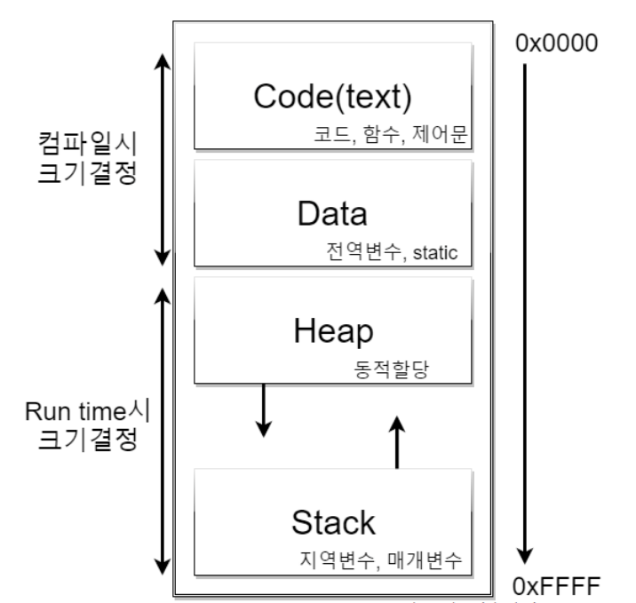
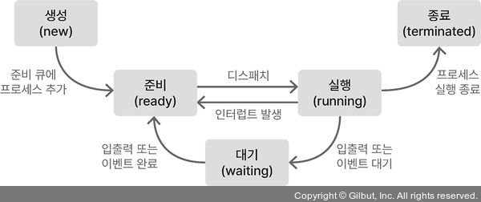

# 프로세스

## 프로세스 정의

운영체제에서 프로그램을 실행하는 작업 단위를 의미한다.

## 프로세스 구조

code(text) : 컴파일된 소스 코드
Data Section : 전역 변수
Heap Section : 런타임 과정에서 동적으로 할당되는 변수
Stack Section : 함수가 실행되는 동안 지역변수가 임시로 저장

## 프로세스 상태

- 생성(new): 프로세스 생성 상태
- 준비(ready): 프로세서에 의해 실행되기를 대기하는 상태
- 실행(running): 프로세스가 자원을 할당받아 수행되는 상태
- 대기(waiting): 프로세스 이벤트가 발생되어 대기하는 상태
- 종료(terminated): 프로세스 실행 종료 상태

## 프로세스 제어 블록(PCB, Process Control Block)

PCB는 프로세스에 대한 정보 블록으로, 운영체제가 프로세스를 관리하기 위해 사용하는 자료구조이다. PCB에는 다음과 같은 정보가 포함된다.

- 프로세스 상태(Process State): 현재 [프로세스의 상태](#프로세스-상태)
- 프로그램 카운터(Program Counter): 이어서 실행해야 할 다음 명령어 주소
- CPU 레지스터(CPU registers): 프로세스가 올바르게 재실행하기 위한 PC와 여러 범용 레지스터 등의 값
- CPU 스케줄링 정보(CPU-scheduling information): 프로세스의 중요도, 스케줄링 큐 포인터 등 프로세스 실행 순서를 정하는 정보
- 메모리 관리 정보(Memory-management information): base, limit 레지스터 값, 페이지 테이블 등 메모리 시스템 정보
- 통계 정보(Accounting Information): 프로세스의 개수, 타임아웃 정보, 실행 ID 등에 사용되는 CPU양의 정보
- 입/출력 상태 정보(I/O status information): 프로세스에 할당된 입출력 장치 목록

# 프로세스 스케줄링

- 멀티프로그래밍(Multi-programming)의 목적은 CPU 효율 극대화를 위해 동시에 여러 프로세스를 실행하는 것
- 시분할 시스템(Time Sharing System)의 목적은 CPU 코어가 빈번하게 프로세스들 사이에서 변경하여 사용자가 각각의 프로그램을 동시에 수행되는 것처럼 하기 위함

## 문맥 교환(Context Switch)

- 프로세스의 Context는 실행을 이어가기 위해 필요한 상태 정보로, PCB에 저장
- 인터럽트가 발생하면 커널은 현재 실행 상태를 저장하여, 인터럽트 처리가 끝난 뒤 기존 작업을 계속할 수 있게 함
- CPU가 현재 프로세스에서 다른 프로세스로 실행 대상을 변경하는 것을 컨텍스트 스위칭
- 컨텍스트 스위칭 중에는 사용자 프로그램의 실제 작업이 진행되지 않으므로, 소요되는 시간은 오버헤드에 해당한다.

# 프로세스에 대한 연산

## 프로세스 생성

- 프로세스는 자식 프로세스를 생성할 수 있으며, 트리 구조를 형성한다.
- 각 프로세스들은 pid로 식별되며 고유한 값을 가진다.
- fork(): 부모 프로세스를 복제하여 자식 프로세스 생성
- exec(): 새 프로그램을 자신 프로세스의 주소 공간에 불러온다. 
- wait(): 자식 프로세스가 종료될 때까지 부모 프로세스를 block 시킨다.
- fork()의 반환값: 부모에게는 자식의 pid, 자식 프로세스에게는 0이 반환된다.

## 프로세스 종료(Process Termination)

- 마지막 명령어 실행 후 `exit()`으로 프로세스를 종료 요청 → 부모에게 `wait()` 시스템 콜을 통해 status를 받는다.
- 부모 프로세스가 자식 프로세스를 종료시키는 경우
  - 자식이 자신에게 할당된 자원을 초과하여 사용하는 경우
  - 자식에게 할당된 task가 더 이상 필요가 없는 경우
  - 부모가 종료되었고, 운영체제가 그 프로세스의 자식이 실행하는 것을 허용하지 않는 경우
- 좀비(zombie): 자식은 종료됐지만 부모가 아직 wait()를 호출하지 않은 상태 
- 고아(orphan): 부모가 wait() 없이 먼저 종료된 경우 → init/systemd가 새 부모가 되어 수거

# 프로세스 간 통신

프로세스가 실행 중인 다른 프로세스들과 영향을 주고받는다면 cooperating process(협력적인 프로세스)이다. 다른 프로세스들과 영향을 주고받지 않는 프로세스는 독립 프로세스(independent process)라고 한다. 이렇게 협력 프로세스를 쓰는 것의 장점은 다음과 같다.

- 여러 프로세스가 같은 정보에 접근하는 경우 정보에 같이 접근할 수 있다
- 특정 작업을 여러 프로세스가 병렬로 실행하게 하기
- 시스템 기능을 별도의 프로세스/스레드로 나눠서 모듈식으로 시스템 구성
- 편의성 증가

이때 프로세스 간 협력을 위해서는 프로세스 간 통신(interprocess communication, IPC)이 필요하다. 이 IPC에는 크게 두 가지 방법이 있다.

- 공유 메모리(shared memory)
- 메시지 전달(message passing)

## 공유 메모리 방식

공유 메모리 방식에서는 협력 프로세스들이 공유하는 메모리 영역이 구축된다. 이 메모리 영역에는 프로세스들이 공유하는 데이터가 저장된다. 프로세스들은 그 영역을 읽고 씀으로써 정보를 교환할 수 있다. 이때 각 프로세스는 공유 메모리 세그먼트를 자신의 주소 공간에 추가해야 한다.

공유 메모리 방식은 공유 메모리 영역을 구축할 때만 시스템 콜을 사용하며 일단 이 영역이 구축되면 모든 접근은 일반 메모리 접근으로 취급되어 커널의 도움이 필요 없어진다. 따라서 메시지 접근 방식보다 빠르다. 단 메모리에 동시 접근하는 것을 막기 위한 구현이 필요하다.(동시에 동일한 위치에 쓰게 되면 데이터가 꼬일 수 있다)

### 생산자-소비자 문제

공유 메모리 방식은 생산자-소비자 문제의 해결책이 될 수 있다. 두 프로세스가 동시에 동작할 때 일어나는 이슈인데, 정보의 생산 속도가 소비 속도보다 보통 빠르기 때문에 일어나는 동기화 문제이다. 생산자와 소비자 프로세스가 공유하는 메모리 영역에 버퍼를 만드는 것으로 이를 해결할 수 있다.

생산자가 생산한 정보는 버퍼에 저장되고 소비자는 버퍼에서 정보를 꺼내서 소비한다. 이때 버퍼에 저장된 정보가 없으면 소비자는 대기하고, 버퍼가 가득 차면 생산자는 대기한다. 이렇게 생산자와 소비자가 동시에 동작할 때 생기는 동기화 문제를 해결할 수 있다.

## 메시지 전달 방식

메시지 전달 방식에서는 프로세스간 통신이 프로세스들 간에 교환되는 메시지를 통해서 이루어진다. 이 방식에선 메모리를 프로세스간에 공유할 필요가 없다.

메시지 전달 방식은 최소 2가지 연산을 제공한다.

- send: 메시지를 전송. 메시지 길이는 고정 길이일 수도 가변 길이일 수도 있다.
- receive : 메시지를 수신. 메시지를 수신할 때까지 대기한다.

이 send/receive를 통해 프로세스간 메시지를 주고받기 위해서는 communication link가 설정되어 있어야 한다. 
그리고 그 링크에서 send, receive를 이용해 메시지를 주고받는다. 이런 메시지 전달 방식 설계에서 고려해야 할 것은 다음과 같다.

- Naming : 통신할 프로세스들이 어떻게 서로를 식별할 것인가?
- Syncronization : 메시지를 주고받는 프로세스들이 어떻게 동기화할 것인가?
- Buffering : 프로세스들 간의 메시지 큐를 어떻게 관리할 것인가?

## Naming

직접 통신의 경우 프로세스는 식별을 위해 상대방의 주소를 알고 있어야 한다. 
즉 P에게 msg를 보내려면 send(P, msg)를 쓰고 Q에서 메시지를 수신하는 것은 receive(Q, msg)를 쓰는 식이다.

mailbox(or port)를 통해서 통신하는 간접 통신의 방법도 있다. 
이 방식의 경우 메시지들은 mailbox로 송신되고 거기로부터 수신된다. 
즉 프로세스 - 메일박스 - 프로세스의 구조이다.

각 메일박스는 고유 id를 가진다. 그리고 두 프로세스가 통신하기 위해서는 서로가 공유하는 메일박스가 있어야 한다. 
send(A, msg), receive(A, msg) 를 통해 메일박스 A와 메시지를 송수신할 수 있다. 이 경우 다수 프로세스간 통신도 가능하다. 단 메시지를 저장할 메일박스가 따로 있어야 한다는 단점이 있다.

## Syncronization

프로세스간 통신은 블로킹, 논블로킹이 있다. 블로킹=동기=synchronous, 논블로킹=비동기=asynchronous. 각각의 특징은 다음과 같다.

- blocking send : 송신한 메시지를 수신자(혹은 mailbox)가 받을 때까지 새로운 송신을 할 수 없다. 
- non-blocking send : 송신한 메시지를 수신자가 받을 때까지 기다리지 않고 송신 과정만 끝나면 송신자는 바로 새로운 송신을 할 수 있다. 
- blocking receive : 메시지가 이용 가능할 때까지 수신 프로세스가 블락된다. 
- non-blocking receive : 송신하는 프로세스가 유효한 메시지 혹은 null을 받는다.

## Buffering

통신하는 프로세스들이 교환하는 메시지는 큐에 들어 있다. 이 큐의 방식은 3가지가 있다.

    zero capacity : 큐 최대 길이 0. 메시지를 따로 보관할 곳이 없으므로 송신자는 수신자가 메시지를 수신할 때까지 기다려야만 한다.
    bounded capacity : 큐 최대 길이가 정해져 있다. 큐가 꽉 차 있다면 송신자는 큐가 꽉 차지 않을 때까지 기다려야 한다.
    unbounded capacity : 큐 최대 길이가 없으며 송신자는 절대 기다리지 않는다.

## 비교

대부분 운영체제에서는 2가지 방식을 모두 구현한다. 메시지 전달 방식은 충돌을 회피할 필요가 없다. 그래서 적은 양의 데이터를 공유하는 데 유용하고 분산 시스템에서 구현하기 쉽다.

그러나 공유 메모리 방식은 빠르다. 메시지 전달 방식은 일반적으로 시스템 콜을 이용해 구현하므로 커널 간섭 등 때문에 느리다. 하지만 공유 메모리 방식은 공유 메모리 영역을 구축할 때만 시스템 콜이 필요하고 그 이후에는 커널의 도움이 필요 없다.

# 실제 IPC 기법
## 파이프

파이프는 두 프로세스가 통신할 수 있게 하는 전달자 역할을 한다. 일반적인 파이프는 단방향 통신만 가능하다. 한쪽에서는 데이터를 쓰고 한쪽에서는 읽는다. 만약 양방향 통신이 필요하다면 각각 다른 방향의 파이프 2개를 써야 한다.

이는 일반적으로 커맨드라인에서 명령을 연결할 때 사용한다. 예를 들어 ls | grep 명령을 실행하면 ls 명령의 결과가 grep 명령의 입력으로 들어간다.

또한 파이프는 구조화된 통신이 없기 때문에 파이프에 포함된 데이터의 크기, 송신자와 수신자를 알 수 없다.

일반 익명 파이프의 제한은 조상 프로세스와만 통신이 가능하다는 것이다.. 따라서 파이프를 사용하려면 부모 프로세스가 파이프를 생성하고 자식 프로세스에게 fork를 이용해서 파이프를 복사해야 한다.

익명 파이프를 만드는 건 pipe 함수를 통해 가능하다. pipe(fd) 함수는 파이프를 생성하고 fd[0]과 fd[1]에 각각 읽기와 쓰기를 위한 파일 디스크립터를 저장한다.

- fd[0] : 읽기 전용 파일 디스크립터
- fd[1] : 쓰기 전용 파일 디스크립터

6.2 지명 파이프

지명 파이프는 일반 파이프의 제한들을 완화시킨다. 지명 파이프는 통신을 양방향으로 가능하게 하고 부모 프로세스와 자식 프로세스가 아닌 다른 프로세스와도 통신이 가능하다.

또 파일 시스템에 존재하여 통신 프로세스가 종료되어도 사라지지 않는다. 실제로 파일처럼 존재하여 open, read, write, close 시스템 콜로 조작할 수 있다.
6.3 소켓

소켓은 통신의 endpoint이다. 각 소켓은 IP 주소와 포트 번호를 가지고 있다. 소켓은 네트워크를 통해 통신을 하기 위한 인터페이스로 정의된다. 그리고 일반적으로 서버-클라이언트가 통신하는 방식이다.

IP주소와 포트 번호로 이루어진 소켓은 일종의 주소 같은 것이라고 생각하면 된다(146.86.5.20:1625와 같이 나타난다). 서버와 클라이언트가 통신을 하기 위해서는 서로의 소켓 주소를 알고 있어야 한다. 그래서 서버는 자신의 소켓 주소를 알려주고 클라이언트는 서버의 소켓 주소를 알아야 한다.

그렇게 클라이언트와 서버가 서로의 소켓 주소를 알고 있으면 TCP, UDP 등의 기법으로 통신을 할 수 있다. 그런데 이때 소켓을 생성한 두 프로세스가 다른 네트워크에 있는 게 아니라 같은 컴퓨터의 같은 운영체제 상에서 실행되고 있다면 소켓을 통한 프로세스 간 통신도 가능하다.