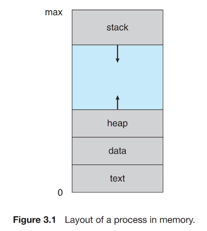
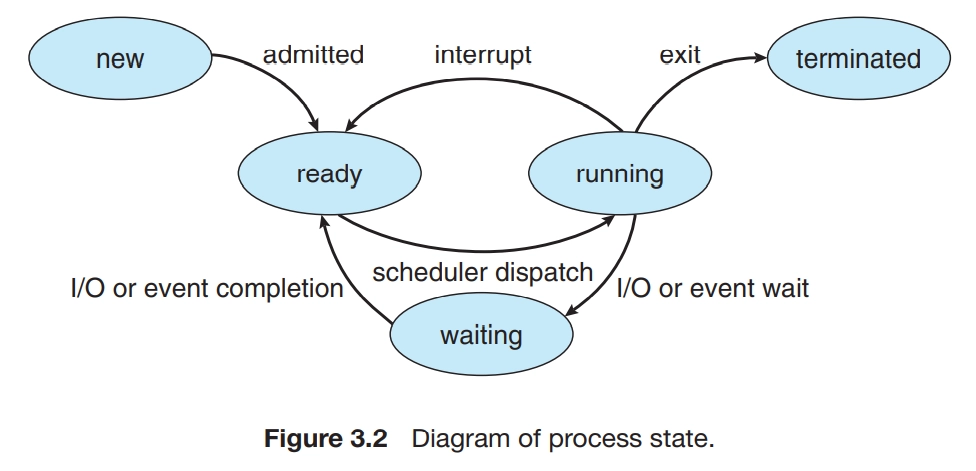
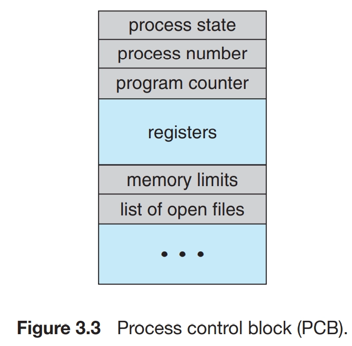
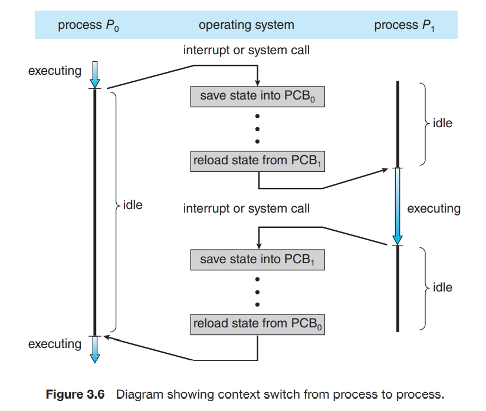

오늘날의 컴퓨터 시스템들은 메모리에 다수의 프로그램이 적재되어 병행 실행 되는 것을 허용한다. 이러한 발전은 다양한 프로그램을 보다 견고하게 제어하고 보다 구획화할 것을 필요로 했다. 이러한 필요성이 프로세스의 개념을 낳았으며, 프로세스란 실행 중인 프로그램을 말한다. 프로세스는 현대의 컴퓨팅 시스템에서 작업의 단위이다.

이 장에서는 프로세스가 무엇인지, 운영체제에서 어떻게 표현되는지 그리고 어떻게 작동하는지에 대해 설명한다.

<aside>

이 장의 목표

- 프로세스의 개별 구성요소를 식별하고 운영체제에서 해당 구성요소가 어떻게 표현되고 스케줄 되는지 기술한다.
- 운영체제에서 프로세스를 생성하고 종료하는 방법을 설명한다. 이러한 작업을 수행하는 적절한 시스템 콜을 사용하여 프로그램의 개발 등이 포함된다.
- 공유 메모리 및 메시지 전달을 사용하는 프로세스 간 통신을 설명하고 대조한다.
- 파이프와 POSIX 공유 메모리를 사용하여 프로세스 간 통신을 수행하는 프로그램을 설계한다.
- 소켓과 원격 프로시저 호출을 사용하여 클라이언트-서버 통신을 설명한다.
- Linux 운영체제와 상호 작용하는 커널 모듈을 설계한다.
</aside>

## 3.1 프로세스 개념(Process Concept)

### 3.1.1 프로세스(The Process)

비공식적으로, 프로세스란 실행 중인 프로그램이다. 프로세스의 현재 활동의 상태는 프로그램 카운터 값과 프로세서 레지스터의 내용으로 나타낸다.

- 텍스트 섹션 — 실행 코드
- 데이터 섹션 — 전역 변수
- 힙 섹션 — 프로그램 실행 중에 동적으로 할당되는 메모리
- 스택 섹션 — 함수를 호출할 때 임시 데이터 저장장소(함수 매개변수, 복귀 주소 및 지역변수)

텍스트 및 데이터 섹션의 크기는 고정되기 때문에 프로그램 실행 시간 동안 크기가 변하지 않는다. 그러나 스택 및 힙 섹션은 프로그램 실행 중에 동적으로 줄어들거나 커질 수 있다. 함수가 호출될 때마다 함수 매개변수, 지역 변수 및 복귀 주소를 포함하는 활성화 레코드가 스택에 푸시 된다. 함수에서 제어가 되돌아오면 스택에서 활성화 레코드가 팝 된다.(콜스택) 마찬가지로 메모리가 동적으로 할당됨에 따라 힙이 커지고 메모리가 시스템에 반환되면 축소된다. 스택 및 힙 섹션이 서로의 방향으로 커지더라도 운영체제는 서로 겹치지 않도록 해야 한다.

프로그램은 명령어 리스트를 내용으로 가진 디스크에 저장된 파일과 같은 수동적 존재이다. 대조적으로 프로세스는 다음에 실행할 명령어를 지정하는 프로그램 카운터와 관련 자원의 집합을 가진 능동적인 존재이다. 실행 파일이 메모리에 적재될 때 프로그램은 프로세스가 된다.

프로세스 자체가 다른 개체를 위한 실행 환경으로 동작할 수 있다는 사실에 주목하자. Java 프로그램은 JVM 안에서 실행된다. JVM은 적재된 Java 코드를 해석하고 그 코드를 대신하여 원 기계어를 이용하여 행동을 취하는 프로세스로서 프로그램을 실행한다.

java 명령어는 JVM을 보통의 프로세스처럼 실행시키고, JVM은 Java 프로그램을 가상기계 안에서 실행한다.

### 3.1.2 프로세스 상태(Process State)

프로세스는 실행되면서 그 상태가 변한다.

- 새로운(new): 프로세스가 생성 중이다.
- 실행(running): 명령어들이 실행되고 있다.
- 대기(waiting): 프로세스가 어떤 이벤트가 일어나기를 기다린다
- 준비(ready): 프로세스가 처리기에 할당되기를 기다린다.
- 종료(terminated): 프로세스의 실행이 종료되었다.

어느 한순간에 한 처리기 코어에서는 오직 하나의 프로세스만이 실행된다는 것을 인식하는 것이 중요하다. 그렇지만, 많은 프로세스가 준비완료 및 대기 상태에 있을 수 있다.

### 3.1.3 프로세스 제어 블록(Process Control Block)

프로세스 제어 블록(PCB)은 특정 프로세스와 연관되어 여러 정보를 수록하며, 다음과 같은 것들을 포함한다.

- 프로세스 상태: new, ready, running, waiting, halted
- 프로그램 카운터: 프로그램 카운터는 이 프로세스가 다음에 실행할 명령어의 주소를 가리킨다.
- CPU 레지스터들: CPU 레지스터는 컴퓨터의 구조에 따라 다양한 수와 유형을 가진다. 프로그램 카운터와 함께 이 상태 정보는, 나중에 프로세스가 다시 스케줄 될 때 계속 올바르게 실행되도록 하기 위해서 인터럽트 발생 시 저장되어야 한다.(ready)
- CPU-스케줄링 정보: 이 정보는 프로세스 우선순위, 스케줄 큐에 대한 포인터와 다른 스케줄 매개변수를 포함한다.

…

요약하면 프로세스 제어 블록(PCB)은 약간의 회계 데이터와 함께 프로세스를 시작시키거나 다시 시작시키는데 필요한 모든 데이터를 위한 저장소의 역할을 한다.

### 3.1.4 스레드(Threads)

이제까지 논의한 프로세스 모델은 프로세스가 단일의 실행 스레드를 실행하는 프로그램임을 암시했다. (사용자가 문자를 입력하면서 동시에 철자 검사기를 실행할 수 없다.) 대부분의 현대 운영체제는 프로세스 개념을 확장하여 한 프로세스가 다수의 실행 스레드를 가질 수 있도록 허용한다. 따라서 프로세스가 한 번에 하나 이상의 일을 수행할 수 있도록 허용한다. 예를 들어, 다중 스레드 워드 프로세서는 하나의 스레드에 사용자 입력 관리를 맡기는 동안 다른 스레드가 철자 검사기를 수행하도록 만들 수 있다.

**스레드를 지원하는 시스템에서는 PCB는 각 스레드에 관한 정보를 포함하도록 확장된다.**

## 3.2 프로세스 스케줄링(Process Scheduling)

다중 프로그래밍의 목적은 CPU 이용을 최대화하기 위하여 항상 어떤 프로세스가 실행되도록 하는 데 있다. 시분할의 목적은 각 프로그램이 실행되는 동안 사용자가 상호 작용할 수 있도록 프로세스들 사이에서 CPU 코어를 빈번하게 교체하는 것이다.

- I/O 바운드 프로세스는 계산에 소비하는 것보다 I/O에 더 많은 시간을 소비하는 프로세스이다.
- CPU 바운드 프로세스는 계산에 더 많은 시간을 사용하여 I/O 요청을 자주 생성하지 않는다.

### 3.2.1 스케줄링 큐(Scheduling Queue)

프로세스가 시스템에 들어가면 **준비 큐**에 들어가서 준비 상태가 되어 CPU 코어에서 실행되기를 기다린다. 이 큐는 일반적으로 연결 리스트로 저장된다.

시스템에는 다른 큐도 존재한다. 프로세스에 CPU 코어가 할당되면 프로세스는 잠시 동안 실행되어 결국 종료되거나 인터럽트 되거나 I/O 요청의 완료와 같은 특정 이벤트가 발생할 때까지 기다린다. 프로세스가 디스크와 같은 장치에 I/O 요청을 한다고 가정하자. 장치는 프로세서보다 상당히 느리게 실행되므로 프로세스는 I/O가 사용 가능할 때까지 기다려야 한다. I/O 완료와 같은 특정 이벤트가 발생하기를 기다리는 프로세스는 대기 큐(wait queue)에 삽입된다.

### 3.2.2 CPU 스케줄링(CPU Scheduling)

CPU 스케줄러의 역할은 준비 큐에 있는 프로세스 중에서 선택된 하나의 프로세스에 CPU 코어를 할당하는 것이다. CPU 스케줄러는 CPU를 할당하기 위한 새 프로세스를 자주 선택해야 한다.

### 3.2.3 문맥 교환(Context Switch)

1.2.1절에서 언급한 것처럼 인터럽트는 운영체제가 CPU 코어를 현재 작업에서 뺏어 내어 커널 루틴을 실행할 수 있게 한다. 이러한 연산은 범용 시스템에서는 자주 발생한다. 인터럽트가 발생하면 시스템은 인터럽트 처리가 끝난 후에 문맥을 복구할 수 있도록 현재 실행 중인 프로세스의 현재 문맥을 저장할 필요가 있다. 이는 결국 프로세스를 중단했다가 재개하는 작업이다. 문맥은 프로세스의 PCB에 표현된다.

CPU 코어를 다른 프로세스로 교환하려면 이전 프로세스의 상태를 보관하고 새로운 프로세스의 보관된 상태를 복구하는 작업이 필요하다. 이 작업은 문맥 교환(context switch)이라고 한다. 문맥 교환이 일어나면, 커널은 과거 프로세스의 문맥을 PCB에 저장하고, 실행이 스케줄된 새로운 프로세스의 저장된 문맥을 복구한다. 문맥 교환이 진행될 동안 시스템이 아무런 유용한 일을 못 하기 때문에 문맥 교환 시간은 순수한 오버헤드이다.

### 3.3 프로세스에 대한 연산(Operation on Process)

대부분 시스템 내의 프로세스들은 병행 실행될 수 있으며, 반드시 동적으로 생성되고, 제거되어야 한다. 그러므로 운영체제는 프로세스 생성 및 종료를 위한 기법을 제공해야 한다.

### 3.3.1 프로세스 생성(Process Creation)

실행되는 동안(run) 프로세스는 여러 개의 새로운 프로세스들을 생성할 수 있다. 그 결과 프로세스의 트리를 형성한다.

유닉스, 리눅스, 윈도우와 같은 대부분의 운영체제들은 유일한 프로세스 식별자(pid)를 사용하여 프로세스를 구분하는데 이 식별자는 보통 정수이다. pid는 시스템의 각 프로세스에 고유한 값을 가지도록 할당된다. 이 식별자를 통하여 커널이 유지하고 있는 프로세스의 다양한 속성에 접근하기 위한 찾아보기(index)로 사용된다.

언제나 pid가 1인 systemd 프로세스가 모든 사용자 프로세스의 루트 부모 프로세스 역할을 수행하고 시스템이 부트될 때 생성되는 첫 번째 사용자 프로세스이다. 시스템이 부팅되면 systemd 프로세스는 다양한 사용자 프로세스를 생성한다.

UNIX와 Linux 시스템에서는 ps 명령어를 이용하여 프로세스들의 목록을 얻을 수 있다.

<aside>

ps -el

</aside>