프로세스란

- 실행중인 프로그램
- 초창기 컴퓨터는 한번에 하나의 프로그램만 실행이 가능했음.
- 메모리에 다수의 프로그램을 적재하고 병행 실행되는것을 허용하면서 나온게 프로세스 개념임.

시스템은

- 일부는 사용자 코드를 실행하고 (프로세스)
- 일부는 운영체제 코드를 실행한다.

## 프로세스 개념

프로세스는 실행중인 프로그램이다.
프로세스의 현재 활동의 상태는 프로그램 카운터 PC 값과 프로세스 레지스터의 내용으로 나타낸다.

텍스트 섹션 (크기 고정)

- 실행 코드
  데이터 섹션 (크기 고정)
- 전역 변수
  힙 섹션 (동적)
- 프로그램 실행중에 **동적**으로 할당되는 메모리
  스택 섹션 (동적)
- 함수를 호출할 때 임시 데이터 저장소
- 함수 매개변수, 복귀 주소 및 지역변수 등

프로세스는 다음에 실행할 명령어를 지정하는 프로그램 카운터와 관련 자원의 집합을 가진 능동적인 존재다. 실행파일이 메모리에 적재될 때 프로그램이 프로세스가 된다.

### **프로세스 상태**

상태 정리

- NEW: 프로세스가 생성 중이다.
- RUNNING: 명령어들이 실행되고 있다.
- WATING: 프로세스가 어떤 이벤트가 일어나기를 기다린다.
- READY: 프로세스가 처리기에 할당되기를 기다린다.
- TERMINATED: 프로세스의 실행이 종료되었다.

상태 전의 정리

- **생성→준비** 허가(admit): 프로세스 생성 후 스케줄링 대상이 됨
- **준비↔실행**: 스케줄러가 CPU 할당(디스패치) / 타임슬라이스 만료·선점되면 다시 준비로
- **실행→대기** I/O·이벤트 요청 시 CPU를 반납하고 블록
- **대기→준비** I/O 완료 시 곧바로 실행이 아니라 준비 큐로 복귀
- **실행→종료** 정상/비정상 종료

### 프로세스 제어 블록

각 프로세스는 운영체제에서 프로세스 제어 블록 PCB에 의해 표현된다.

프로세스 상태

- new, ready, running, waiting,terminated
  프로그램 카운터
- 프로세스가 다음에 실행할 명령어의 주소를 가리킴
  CPU 레지스터들
- 컴퓨터 구조에 따라 다양한 수와 유형을 갖는다.
- accumulator (누산기), 인덱스 레지스터, 스택 레지스터, 범용 레지스터, 상태 코드 등.
- PC와 CPU 레지스터 값은 프로세스가 인터럽트 발생 시 저장되어 중단 후 재시작 될 때 사용된다.
  CPU 스케쥴링 정보
- 프로세스 우선순위, 스케쥴 큐에 대한 포인터 & 다른 스케줄 매개변수
  메모리 관리 정보
- 운영체제에 의해 사용되는 메모리 시스템에 따른 기준 레지스터 & 한계 레지스터 값.
- 메모리 시스템에 따른 페이지 테이블, 세그먼트 테이블.
  회계 정보
- CPU 사용시간, 경과된 실시간, 시간 제한, 계정 번호, 프로세스 번호 등
  입출력 상태 정보
- 프로세스에 할당된 입출력 장치들 & 열린 파일의 목록

### 스레드

프로세스가 단일의 실행 스레드를 실행하는 프로그램이다.

## 프로세스 스케줄링

다중 프로그래밍의 목적

- CPU 이용을 최대화하기 위하여 항상 어떤 프로세스가 실행되도록 하는데 있음.

시분할의 목적

- 각 프로그램이 실행되는 동안 사용자가 상호작용할 수 있도록 프로세스들 사이에서 CPU 코어를 빈번하게 교체하는 것.

이 목적을 달성하기 위해 프로세스 스케줄러는 코어에서 실행가능한 여러 프로세스 중에서 하나의 프로세스를 선택한다.

### 스케줄링 큐

준비 큐 Ready Queue

- 프로세스가 시스템에 들어가면 준비 큐에 들어가서 준비 상태가 되어 대기한다.
- 이 준비 큐는 링크드 리스트로 저장된다.
- 준비큐 헤더에는 리스트의 첫번째 PCB에 대한 포인터가 저장된다. **각 PCB에는 준비 큐의 다음 PCB를 가리키는 포인터 필드가 포함**된다.

대기 큐 Wait Queue

- I/O 완료와 같은 특정 이벤트가 발생하기를 기다리는 프로세스는 대기큐에 삽입된다.

**프로세스 스케줄링을 나타내는 큐잉 다이어그램**

- 프로세스가 I/O 요청을 공표한 다음 I/O 대기 큐에 놓일 수 있다.
- 프로세스는 새 자식 프로세스를 만든 다음 자식의 종료를 기다리는 동안 대기 큐에 놓일 수 있다.
- 인터럽트 또는 타임슬라이스가 만료되어 프로세스가 코어에서 강제로 제거되어 준비 큐로 돌아갈 수 있다.

### CPU 스케줄링

프로세스는 수명주기 동안 준비 큐와 다양한 대기큐를 옮긴다.

CPU 스케줄러의 역할

- 준비 큐에 있는 프로세스 중에서 선택된 하나의 프로세스에 CPU 코어를 할당하는 것.
- 새 프로세스를 자주 선택해야함.

### 문맥교환

인터럽트

- 운영체제가 CPU 코어를 현재 작업에서 뺏어 내어 커널 루틴을 실행할 수 있게 한다.

인터럽트가 발생하면

- 시스템은 인터럽트 처리가 끝난 후에 문맥을 복구할 수 있도록 현재 실행중인 프로세스의 현재 문맥을 저장해야한다.
- 즉, 프로세스를 중단했다가 재개하는 작업이다.
- 문맥은 PCB에 표현된다.

문맥 교환 (Context Switch)

- 이전의 프로세스의 상태를 보관하고, 새로운 프로세스의 보관된 상태를 복구하는 작업

## 프로세스에 대한 연산

프로세스 생성 및 종료를 위한 기법

### 프로세스 생성

실행되는 동안 프로세스는 여러개의 새로운 프로세스들을 생성할 수 있다.
프로세스를 생성하는 프로세스를 부모 프로세스라고 부르며, 새로운 프로세스는 자식 프로세스라고 부른다.
이러한 반복을 통해 프로세스의 트리를 형성한다.

부모 프로세스는 자식 프로세스를 생성할 때

1. 자식과 병행하게 실행을 계속하는 방법.
2. 일부 또는 모든 자식이 실행을 종료할 때까지 기다리는 방법
   2가지 방식이 있다.

자식 관점에서는

1. 자식 프로세스는 부모 프로세스의 복사본인 것. (자식 프로세스가 부모와 똑같은 프로그램과 데이터를 가짐)
2. 자식 프로세스가 자신에게 적재될 새로운 프로그램을 갖고 있는 것.
   주소 공간 측면에서 2가지 방식으로 볼 수 있다.

부모 프로세스가 자식 프로세스를 wait()로 기다리지 않고 종료한다면 자식 프로세스를 고아(orpah) 프로세스라고 부른다.

## 프로세스 간 통신

프로세스 협력을 허용하는 환경을 왜 제공할까?

1. 정보 공유 - 여러 응용 프로그램이 동일한 정보에 흥미를 느낄 수 있음. 그러면 정보를 병행적으로 접근할 수 있는 환경을 제공해야한다.
2. 계산 가속화 - 서브 태스크로 나누어 병렬로 실행되게 할때.
3. 모듈성 - 프로세스들 또는 스레드들로 나누어 모듈식 형태로 시스템을 구성하기를 원할 때

**프로세스 간 통신 (Interprocess Communication, IPC)**

방법 2가지

- 공유 메모리
- 메시지 전달

> 공유 메모리 모델

> 메시지 전달 모델

**공유 메모리 vs 메시지 전달**

- 공유 메모리는 커널이 영역만 만들어주고 이후엔 프로세스끼리 직접 접근하므로 **빠르지만**, 동시 접근 시 동기화(뮤텍스·세마포어)를 직접 책임져야 함.
- 메시지 전달은 매번 커널을 거쳐 복사가 일어나 **상대적으로 느리지만**, 동기화가 send/receive에 내장돼 있고 프로세스 간 격리가 좋아 안전하다.

> 크롬의 프로세스 간 통신 예시

**크롬이 둘을 함께 쓰는 이유**  
탭마다 렌더러를 별도 프로세스로 격리(샌드박스)해두고, "이 URL 열어라 / 이 이벤트 처리해라" 같은 제어 신호는 안전성이 중요하니 메시지 전달(Mojo IPC)로 보낸다.
반면 매 프레임 렌더링된 비트맵·비디오처럼 크고 빈번한 데이터는 메시지로 복사하면 느려서, 공유 메모리로 넘겨 GPU 프로세스가 바로 합성하게 합니다.
즉 안전성이 필요한 곳엔 메시지 전달, 성능이 필요한 곳엔 공유 메모리를 쓰는 전형적인 조합입니다.

**IPC in 공유 메모리 시스템**

통신하는 프로세스들이 공유 메모리 영역을 구축해야함.
공유 메모리 영역은 **공유 메모리 세그먼트를 생성하는 프로세스의 주소공간에 위치**한다.

이 공유 메모리 세그먼트를 이용하여 통신하고자 하는 다른 프로세들은 **이 세그먼트를 자신의 주소 공간에 추가**해야한다.

**IPC in 메시지 전달 시스템**

통신을 원하는 프로세스들은 서로를 가르킬 방법이 있어야 한다. 이를 위해 2가지 방식이 존재한다.

직접 통신

- 통신을 원하는 각 프로세스는 통신의 수신사/송신자의 이름을 명시해야한다.
- 연결은 정확히 두 프로세스 사이에만 연관된다.
- 대칭 방식
  - 송신사, 수신자 프로스세가 모두 통신하려면 상대방의 이름을 제시해야한다.
- 비대칭 방식 - 송신자만 수신자의 이름을 지명한다. - 수신자는 임의의 프로세스로부터 메시지를 전달받게 된다.
  간접 통신
- 메시지들은 메일박스로 송신되고 그것으로부터 수신돤다.
- 마치 카프카의 메시지 브로커같은 공간이 생기는것.
- 메일 박스는 추상적으로 프로세스들에 의해 메시지들이 넣어지고 메시지들이 제거될 수 있는 객체라고도 볼 수 있다.
- 하나의 프로세는 다수의 상이한 메일박스를 통해서 다른 프로세스들과 통신할 수 있다.

메시지 통신을 위한 버퍼링

- 메시지는 임시 큐에 들어가 있다.

큐 규현 3가지

1. 무용량 - 큐의 최대 길이가 0으로 대기하는 메시지는 없다. 송신 시 수신할 때까지 기다려야한다.
2. 유한 용량 - 큐는 유한한 길이 N을 갖는다. 큐가 가득차기전까지는 계속 보낸다.
3. 무한 용량 - 큐는 무한한 길이를 갖는다. 항상 막힘없이 보낸다.

## IPC 시스템의 사례

POSIX 공유 메모리
Mach 메시지 전달
Windows

## 클라이언트 서버 환경에서의 통신

클라이언트 서버에서 사용할 수 있는 통신 전략 2가지

- 소켓 통신 (Sockets)
- 원격 프로시저 호출 (PRCs)

### 소켓

소켓은 통신의 극점(endpoint)을 뜻한다. 두 프로세스가 네트워크상에서 통신을 하려면 양 프로세스마다 하나씩, 총 2개의 소켓이 필요하다.

각 소켓은 IP 주소와 포트번호 두가지를 접합해서 구별한다.

일반적으로 소켓은 클라이언트-서버 구조를 사용한다. 서버는 지정된 포트에 클라이언트 요청 메시지가 도착하기를 기다리게 된다. 요청이 수신되면 서버는 클라이언트 소켓으로부터 요청 연결을 수락함으로서 연결이 완성된다.

Telnet, FTP, HTTP 등의 특정 서비스를 구현하는 서버는 well-known 포트로 부터 메시지를 기다린다.

- well known 포트는 전세계 표준으로 사용하는 포트번호를 말한다. SST: 22, FTP: 21, HTTP: 80 포트 등)

클라이언트 프로세스가 연결을 요청하면 호스트 컴퓨터가 포트 번호를 부여한다.

Java는 세가지 종류의 소켓을 제공한다.

- 연결기반: TCP - Socket()
- 비연결성: UPD - DatagramSocket()
- MulticastSocket()

### 원격 프로시저 호출 RPC

다른 컴퓨터에 있는 프로세스에서 함수를 호출할 수 있는 방식으로 함수(프로시저) 호출 개념을 추상화.
