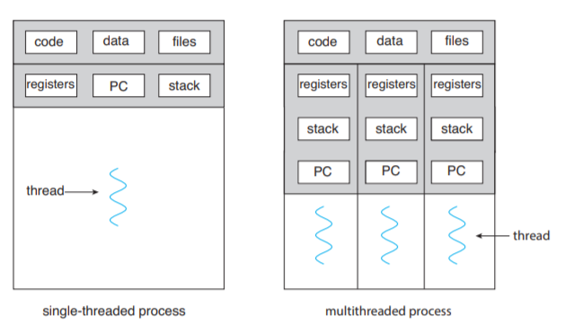
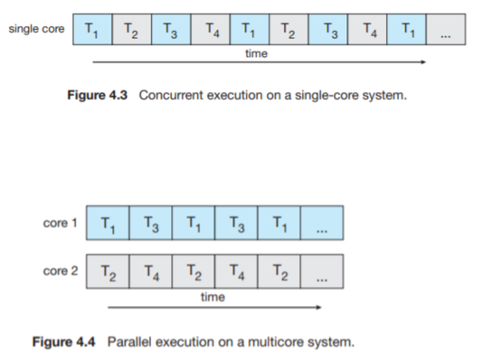
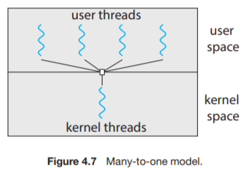
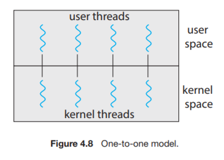
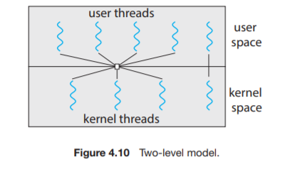
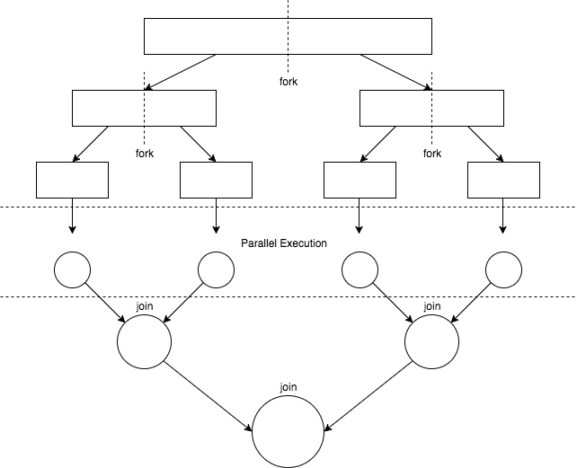

## 스레드

스레드는 CPU 이용의 기본 단위로,
TID(Thread ID), PC(Program Counter), Register set, Stack으로 구성되어 있다.

스레드는 같은 프로세스 내부에 속한 다른 스레드와 코드 영역, 데이터 영역, 열린 파일 등 운영체제 자원을 공유한다.

이렇게 하나의 프로세스가 여러 개의 스레드를 가지는 것을 멀티스레드라고 한다.

예전에는 다양한 요청들을 받기 위해 멀티 프로세스를 사용했지만, 
프로세스 생성 비용이 무겁고, 컨택스트 스위칭의 오버헤드로 인한 메모리 사용량이 많아지기 때문에 현대에서는 그냥 멀티스레드를 사용한다.

멀티 스레딩이 그리 잘 났나?

- 응답성(Responsiveness): 다른 스레드에 문제가 생기거나, 작업을 수행해도 다른 스레드로 응답성을 유지할 수 있다.
- 자원 공유(Resource Sharing): 스레드는 같은 프로세스 내에서 자원을 공유하기 때문에, IPC 작업이 필요없다.
- 경제성(Economy): 프로세스에 비해 스레드가 생성과 컨텍스트 스위칭 비용이 적다.
- 확장성(Scalability): 멀티코어 환경에서 각각의 스레드가 병렬로 실행할 수 있다.

---

## 멀티코어 프로그래밍

그림을 보면 알겠지만, 코어가 1개면 결국 스레드만 돌아가면서 작업할 뿐이다. 
하지만 코어가 여러개가 된다면, 다음과 같이 병렬처 리해서 작업을 할 수 있기 때문에 더 효율적이다.

> 동시성: 동시에 여러 작업이 실행되는 것처럼 보임 
> 병렬성: 동시에 여러 작업이 실행되는 것

멀티 코어 프로그래밍을 하면 병렬성을 활용할 수 있기 때문에, 멀티코어 환경에서 성능을 향상시킬 수 있다.
하지만, 신경 써야하는 부분들 또한 생기게 된다.

- 작업 식별(Identifying tasks): 병령 실행 가능하도록, 작업을 독립된 태스크로 나누는 것
- 균형(Balance): 각각의 스레드가 작업에 대한 분배를 균등하게 하는 것 
- 데이터 분할(Data Splitting): 작업을 수행하는데 필요한 데이터를 분배하는 것
- 데이터 종속(Data Dependency): 작업 간 데이터 의존도를 확인하고, 종속적이면 동기화 과정이 필요
- 시험 및 디버깅(Testing and Debugging): 실행 경로가 다양해져 디버깅이 더 복잡

### 병렬성의 유형

- 데이터 병렬성(Date parallelism): 데이터의 부분 집합을 각 코어에 분배해서 동일한 연산 수행    
- 태스크 병렬성(Task parallelism): 태스크를 각 코어에 분배해서 서로 다른 연산 수행

--- 

## 멀티스레딩 모델 (Multithreading Models)

스레드는 유저 스레드와 커널 스레드로 나뉘고,
이 둘을 매핑하는 방식에 따라 3가지 모델로 나뉜다.

### 다대일 모델(Many-to-One Model)

- N 유저 스레드: 1 커널 스레드 매핑
- 스레드 관리가 사용자 공간에서 이루어져 효율적
- 한 스레드가 블로킹 시스템 콜을 하면 전체 프로세스가 블로킹 
- 한 번에 하나의 스레드만 커널에 접근할 수 있어 멀티코어라도 병렬 실행이 불가능

### 일대일 모델 (One-to-One Model)

- 1 유저 스레드: 1 커널 스레드 매핑
- 한 스레드가 블로킹되어도 다른 스레드가 실행 가능하여 동시성이 높음
- 멀티코어에서 병렬 실행 가능
- 유저 스레드를 마다 커널 스레드가 필요해서 성능 부하  

> Linux와 Windows가 이 모델을 사용

### 다대다 모델 (Many-to-Many Model)

- 각각의 유저 스레드에 대해 멀티플렉싱
- Many-To-One Model의 단점인 병렬성 확보 불가와, One-To-One의 단점인 과도한 스레드 생성을 보완한 모델
- 원하는 만큼 사용자 스레드를 만들어서 병렬성도 확보

> 요즘은 코어 수가 많아져 커널 스레드 수 제한의 필요성이 줄어들어, 다대다 모델 보다 일대일 모델을 많이 사용한다.

---

## 스레드 라이브러리(Threads Library)

프로그래머에게 스레드를 생성 및 관리 API를 제공

스레드 라이브러리를 구현하는 데에는
- 커널의 지원 없이 유저 공간에서 제공 → 모든 코드와 자료구조가 유저 공간에 존재하기 때문에, 함수 호출은 지역 함수를 호출하는 것
- 커널 수준 라이브러를 구현 → 코드와 자료구조는 커널 공간에 존재하며, API 호출은 System Call로 귀결

스레드 전략에도
- 비동기 스레딩(Asynchronous threading): 부모가 자식 스레드를 생성한 이후 독립적으로 실행하는 것. 독립적으로 돌아가기 때문에 데이터 공유는 거의 없다. 
- 동기 스레딩(Synchronous threading): 부모가 자식이 모두 종료될 때 까지 기다리고 재개하는 것. 포크-조인 (fork-join) 전략이라고도 하는데, 모든 자식이 조인 될 때까지 기다리는 것을 의미한다. 잦은 데이터 공유를 수반한다. 

---

## 암묵적 스레딩 (Implicit Threading)

암묵적 스레딩(Implicit Threading): 스레드의 생성 및 관리의 책임을 컴파일러와 런타임 라이브러리에게 위임하는 것.

### 스레드 풀(Thread Pool)

1. 프로세스 시작 시 일정 수의 스레드를 미리 만들어 풀에 대기
2. 작업이 오면 풀의 스레드에 할당
3. 작업이 끝나면 스레드는 풀로 복귀.

장점으로는,
- 새로운 스레드를 만들고, 없애는데 소요되는 오버헤드가 사라짐
- 시스템 자원 고갈 방지
- 작업 생성과 실행을 분리해 다양한 실행 전략(지연 실행, 주기 실행 등) 적용 가능

### 포크-조인 (Fork-Join)

부모 스레드가 작업을 여러 하위 작업으로 fork(분기)하고, 완료를 기다렸다가 join(합류)하여 결과를 합침
분할 정복(divide-and-conquer) 알고리즘과 잘 맞음 (예: 병합 정렬)
자바의 Fork-Join 프레임워크 (ForkJoinPool, RecursiveTask, RecursiveAction)가 대표적. 
작업이 충분히 작아지면 직접 계산하고, 크면 둘로 나눠 재귀적으로 fork한다.

---

## 스레딩과 관련된 이슈들 (Threading Issues)

### fork()와 exec() System Call

앞에서 다뤘던 것 과는 달리, 멀티 스레딩 환경에선 다른 의미가 될 수 있다.
만약에 특정 스레드가 fork()를 실행하면 새로운 프로세스는 모든 스레드를 복사해야 할까? 아니면 호출한 친구 하나만 복사하면 될까? 결론은 둘 다 지원한다.
exec()의 경우엔, 3장에서 서술했던 것과 동일한 프로세스를 가진다. 즉, 모든 스레드를 포함한 전체 프로세스를 통째로 교차해버린다.
실예로, fork()하고 exec()를 한다면 굳이 모든 스레드를 복사할 이유가 없을 것이다. 다만, fork() 이후 exec()를 실행하지 않는다면? 이런 경우엔 모든 스레드를 복사할 필요가 있을 것이다.

### 시그널 처리 (Signal Handling)

UNIX에서 시그널은 특정 이벤트 발생을 프로세스에 알리는 수단. 동기 시그널(예: 0으로 나누기, 잘못된 메모리 접근)과 비동기 시그널(예: Ctrl+C, 타이머 만료)이 있다.
시그널 처리기는 디폴트 처리기와 사용자 정의 처리기가 있다.
멀티스레드 프로세스에서 시그널을 누구에게 전달할 것인가? 선택지:
    시그널이 적용되는 스레드에게 전달 (동기 시그널)
    프로세스 내 모든 스레드에게 전달
    특정 스레드들에게만 전달
    시그널 수신 전담 스레드 지정

### 스레드 취소 (Thread Cancellation)

레드가 끝나기 전에 강제 종료시키는 작업을 일컫는다.

취소되어야 할 스레드를 목표 스레드 (Target Thread)라고 한다. 목표 스레드의 취소는 두 가지 방법으로 이루어진다.

- 비동기식 취소 (Asynchronous Cancellation): 한 스레드가 즉시 목표 스레드를 강제 종료 시킨다.
- 지연 취소 (Deferred Cancellation): 목표 스레드가 주기적으로 강제 종료되어야 할 지를 점검한다. 이 경우 스스로 강제 종료될 수 있는 기회가 만들어진다.

자원 문제는 어떤식으로 해결할까? 일단 전자의 경우엔 최악의 경우 OS가 스레드로부터 자원을 회수하지 못 할 수 있다. 후자의 경우 목표 스레드가 플래그를 검사한 이후에 발생하므로 스스로 안전한 시점에 취소를 할 수 있다.

### 스레드 로컬 저장소 (Thread-Local Storage, TLS)

스레드는 프로세스 데이터를 공유하지만, 경우에 따라 각 스레드만의 고유 데이터가 필요하다. (예: 트랜잭션 ID)
지역 변수와 달리 함수 호출을 넘어 스레드 수명 전체에서 유지된다.
자바에서는 ThreadLocal<T> 클래스가 이에 해당.

### 스케줄러 액티베이션 (Scheduler Activations)

다대다/두 수준 모델에서 커널과 스레드 라이브러리 간 통신 문제를 해결하는 기법
커널은 LWP(Light Weight Process)라는 중간 자료구조를 애플리케이션에 제공. LWP는 사용자 스레드와 커널 스레드 사이의 가상 프로세서 역할
커널이 특정 이벤트(예: 스레드 블로킹)를 애플리케이션에 알리는 것을 업콜(upcall)이라 하며, 스레드 라이브러리의 업콜 핸들러가 이를 처리해 다른 스레드를 스케줄링할 수 있게 한다.

