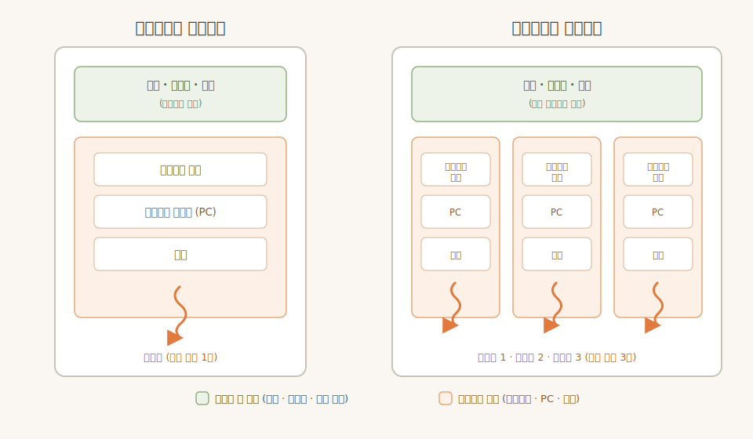

# 운영체제 Chapter 4. 스레드와 동시성 (Threads & Concurrency)

> Operating System Concepts (공룡책) 4장 정리 노트

---

## 4.1 개요 (Overview)

### 스레드란?

- **스레드(Thread)는 CPU 이용(활용)의 기본 단위**이다.
- 스레드는 다음으로 구성된다.
    - 스레드 ID (tid)
    - 프로그램 카운터 (PC) — CPU 안의 특별한 레지스터로, **다음에 실행할 명령어의 메모리 주소**를 담는다. 스레드마다 실행 위치가 다르므로 각자 하나씩 가진다.
    - 레지스터 집합 (Register set) — CPU 내부의 가장 빠른 소형 저장 공간들로, **현재 계산 중인 값과 실행 상태**를 담는다. 컨텍스트 스위칭 시 저장/복원되는 대상이 바로 이것이다.
    - 스택 (Stack) — 함수 호출 정보(지역 변수, 매개변수, 복귀 주소)를 담는 스레드 고유 영역.
- 같은 프로세스에 속한 다른 스레드와는 **코드 영역, 데이터 영역, 열린 파일 등 운영체제 자원을 공유**한다.
- 즉, 하나의 프로세스가 여러 개의 실행 흐름(스레드)을 가질 수 있으며, 이를 **멀티스레드(multithreaded) 프로세스**라고 한다.



### 왜 스레드를 쓰는가?

하나의 애플리케이션을 여러 프로세스로 쪼개는 것은 비효율적이다.
- 프로세스 생성 비용이 크고(무겁고),
- 컨텍스트 스위칭 오버헤드가 크며,
- 프로세스 간 통신(IPC)이 별도로 필요하다.

그래서 프로세스 내부에 여러 실행 흐름을 두는 스레드 개념이 도입되었다. 스레드 생성은 프로세스 생성보다 훨씬 가볍고, 같은 주소 공간을 공유하므로 통신도 간단하다.

예시: 여러 이미지의 썸네일을 만드는 프로그램은 이미지마다 스레드를 하나씩 두어 처리할 수 있고, 웹 브라우저는 화면 표시 스레드와 네트워크 수신 스레드를 분리할 수 있다. 웹 서버는 클라이언트 요청마다 스레드를 생성해 처리한다.

### 멀티스레딩의 장점 4가지

1. **응답성 (Responsiveness)**: 일부 스레드가 블로킹되거나 긴 작업을 수행해도 다른 스레드가 계속 실행되므로 사용자 응답성이 좋아진다. (특히 UI 프로그램)
2. **자원 공유 (Resource Sharing)**: 스레드는 프로세스의 메모리와 자원을 기본적으로 공유하므로, 공유 메모리나 메시지 전달 같은 별도의 IPC 기법이 필요 없다.
3. **경제성 (Economy)**: 프로세스 생성보다 스레드 생성이 훨씬 저렴하고, 컨텍스트 스위칭도 스레드 간 전환이 더 빠르다.
4. **확장성 (Scalability)**: 멀티코어(멀티프로세서) 환경에서 각 스레드가 서로 다른 코어에서 병렬로 실행될 수 있다.

---

## 4.2 멀티코어 프로그래밍 (Multicore Programming)

### 동시성 vs 병렬성

- **동시성(Concurrency)**: 여러 작업이 "모두 진행 중"인 상태. 단일 코어에서도 시간 분할(time slicing)로 스레드를 번갈아 실행하면 동시성은 달성된다.
- **병렬성(Parallelism)**: 여러 코어에서 여러 작업이 "실제로 동시에" 실행되는 것. 병렬성이 있으려면 코어가 여러 개 필요하다.
- 병렬성 없이 동시성은 가능하다. (단일 코어 + 스케줄링)

### 멀티코어 프로그래밍의 5가지 어려움

1. **작업 식별 (Identifying tasks)**: 병렬로 실행할 수 있도록 작업을 독립적인 단위로 나누는 것
2. **균형 (Balance)**: 각 작업이 비슷한 양의 일을 하도록 분배하는 것
3. **데이터 분할 (Data splitting)**: 작업이 접근하는 데이터도 나눠야 함
4. **데이터 종속성 (Data dependency)**: 작업 간 데이터 의존이 있으면 실행 순서 동기화가 필요
5. **시험 및 디버깅 (Testing and debugging)**: 실행 경로가 다양해져서 디버깅이 훨씬 어려움

### 병렬성의 두 유형

- **데이터 병렬성 (Data parallelism)**: 동일한 데이터의 부분집합을 여러 코어에 분배하고 각 코어에서 같은 연산을 수행. (예: 배열 합을 절반씩 나눠 계산)
- **태스크 병렬성 (Task parallelism)**: 데이터가 아니라 작업(태스크) 자체를 여러 코어에 분배. 각 스레드가 서로 다른 연산을 수행.

### 암달의 법칙 (Amdahl's Law)

코어를 추가해서 얻을 수 있는 성능 향상의 한계를 나타내는 공식.

```
speedup ≤ 1 / (S + (1 - S) / N)
```

- S: 순차적으로 실행되어야 하는 부분의 비율
- N: 코어 수
- 순차 실행 부분(S)이 성능 향상의 상한선을 결정한다. 예를 들어 S = 25%라면 코어를 무한히 늘려도 최대 4배 이상 빨라질 수 없다.

---

## 4.3 멀티스레딩 모델 (Multithreading Models)

스레드 지원은 두 수준에서 제공된다.

- **사용자 스레드 (User threads)**: 커널 위에서 동작, 커널의 개입 없이 사용자 수준 라이브러리가 관리
- **커널 스레드 (Kernel threads)**: 운영체제 커널이 직접 지원하고 관리

사용자 스레드와 커널 스레드의 매핑 방식에 따라 세 가지 모델이 있다.

### (1) 다대일 모델 (Many-to-One)

- 여러 사용자 스레드를 하나의 커널 스레드에 매핑
- 스레드 관리가 사용자 공간에서 이루어져 효율적
- 단점: 한 스레드가 블로킹 시스템 콜을 하면 전체 프로세스가 블로킹됨. 또한 한 번에 하나의 스레드만 커널에 접근할 수 있어 멀티코어에서 **병렬 실행이 불가능**
- 요즘은 거의 사용되지 않음 (예: 과거 Green threads)

### (2) 일대일 모델 (One-to-One)

- 사용자 스레드 하나당 커널 스레드 하나를 매핑
- 한 스레드가 블로킹되어도 다른 스레드가 실행 가능 → 동시성이 좋음
- 멀티코어에서 병렬 실행 가능
- 단점: 사용자 스레드를 만들 때마다 커널 스레드가 필요하므로, 스레드가 많아지면 시스템 성능에 부담
- **Linux와 Windows가 이 모델을 사용** (Java 스레드도 이 위에서 일대일로 동작)

### (3) 다대다 모델 (Many-to-Many)

- 여러 사용자 스레드를 그보다 적거나 같은 수의 커널 스레드에 멀티플렉싱
- 커널 스레드 수는 애플리케이션이나 머신에 따라 결정 (예: 8코어 시스템에서는 4코어보다 더 많은 커널 스레드 할당 가능)
- 원하는 만큼 사용자 스레드를 만들 수 있으면서 병렬성도 확보되는 유연한 모델
- 단점: 구현이 어려움. 또한 요즘은 코어 수가 많아져 커널 스레드 수 제한의 의미가 줄어들어 실제로는 일대일 모델이 대세
- 변형: **두 수준 모델(Two-level model)** — 다대다 + 특정 사용자 스레드를 커널 스레드에 일대일로 묶는 것도 허용

---

## 4.4 스레드 라이브러리 (Thread Libraries)

스레드 라이브러리는 프로그래머에게 스레드 생성/관리 API를 제공한다. 구현 방식은 두 가지:
1. 커널 지원 없이 사용자 공간에서만 제공
2. 커널 수준에서 제공 (라이브러리 호출 = 시스템 콜)

대표적인 세 가지 라이브러리: **Pthreads, Windows thread, Java thread**

스레드 생성 전략도 두 가지로 나뉜다.
- **비동기 스레딩 (Asynchronous threading)**: 부모가 자식 스레드를 만든 후 자신도 계속 실행. 부모-자식이 독립적으로 동작
- **동기 스레딩 (Synchronous threading)**: 부모가 자식들을 만든 뒤 모두 종료할 때까지 대기(join) — fork-join 방식

### Pthreads

- POSIX 표준(IEEE 1003.1c)이 정의한 스레드 API **명세(specification)** — 구현이 아님
- UNIX, Linux, macOS에서 주로 사용
- `pthread_create()`로 스레드 생성, `pthread_join()`으로 대기

### Windows Threads

- Windows API로 커널 수준 스레드 제공
- `CreateThread()`, `WaitForSingleObject()` 등 사용

### Java Threads

자바 개발자 입장에서 가장 익숙한 부분. JVM 위에서 스레드 API를 제공하며, JVM은 호스트 OS의 스레드 모델 위에서 구현된다 (Windows/Linux에서는 결국 일대일 모델).

스레드를 만드는 두 가지 방법:

```java
// 1. Thread 클래스 상속
class MyThread extends Thread {
    @Override
    public void run() { /* 작업 */ }
}

// 2. Runnable 인터페이스 구현 (권장)
Thread t = new Thread(() -> {
    System.out.println("작업 실행");
});
t.start();      // 스레드 시작
t.join();       // 종료 대기 (동기 스레딩)
```

- 자바는 공유 데이터를 전역 변수로 두는 방식이 없으므로, 스레드 간 데이터 공유는 객체 참조를 넘겨서 이루어진다.
- 최신 자바에서는 `Thread`를 직접 다루기보다 **Executor 프레임워크**를 권장:

```java
ExecutorService pool = Executors.newFixedThreadPool(4);
Future<Integer> result = pool.submit(() -> 1 + 2); // Callable
System.out.println(result.get()); // 결과 대기 및 획득
```

- `Callable` + `Future`를 쓰면 스레드 실행 결과를 반환받을 수 있다.

---

## 4.5 암묵적 스레딩 (Implicit Threading)

스레드가 수백~수천 개로 늘어나면 개발자가 직접 관리하기 어렵다. 그래서 **스레드 생성/관리를 개발자가 아닌 컴파일러와 런타임 라이브러리에 맡기는** 암묵적 스레딩이 등장했다. 개발자는 병렬로 실행 가능한 "작업(task)"만 정의하면 된다.

### (1) 스레드 풀 (Thread Pool)

- 프로세스 시작 시 일정 수의 스레드를 미리 만들어 풀에 대기시키고, 작업이 오면 풀의 스레드에 할당. 작업이 끝나면 스레드는 풀로 복귀.
- 장점:
    - 스레드를 새로 만드는 것보다 기존 스레드로 처리하는 것이 빠름
    - 스레드 수가 풀 크기로 제한되어 시스템 자원 고갈 방지
    - 작업 생성과 실행을 분리해 다양한 실행 전략(지연 실행, 주기 실행 등) 적용 가능
- 자바에서는 `Executors.newFixedThreadPool()`, `newCachedThreadPool()` 등이 이에 해당

### (2) 포크-조인 (Fork-Join)

- 부모 스레드가 작업을 여러 하위 작업으로 **fork**(분기)하고, 완료를 기다렸다가 **join**(합류)하여 결과를 합침
- 분할 정복(divide-and-conquer) 알고리즘과 잘 맞음 (예: 병합 정렬)
- 자바의 **Fork-Join 프레임워크** (`ForkJoinPool`, `RecursiveTask`, `RecursiveAction`)가 대표적. 작업이 충분히 작아지면 직접 계산하고, 크면 둘로 나눠 재귀적으로 fork한다. (work stealing 방식으로 스케줄링)

### (3) OpenMP

- C/C++/Fortran용 컴파일러 지시문(directive) 기반 API
- `#pragma omp parallel` 같은 지시문으로 병렬 영역(parallel region)을 표시하면 컴파일러가 코어 수만큼 스레드를 생성해 병렬 실행

### (4) Grand Central Dispatch (GCD)

- Apple(macOS, iOS)의 기술. 작업을 블록(block)/클로저 단위로 정의해 **디스패치 큐**(dispatch queue)에 넣으면 시스템이 스레드 풀에서 꺼내 실행
- 큐 종류: 직렬 큐(serial, 순서대로 하나씩), 병행 큐(concurrent, 여러 개 동시에)

### (5) Intel TBB (Thread Building Blocks)

- C++ 병렬 프로그래밍용 템플릿 라이브러리. `parallel_for` 등으로 루프를 병렬화

---

## 4.6 스레딩과 관련된 이슈들 (Threading Issues)

### (1) fork()와 exec()

- 멀티스레드 프로그램에서 한 스레드가 `fork()`를 호출하면, 새 프로세스가 **모든 스레드를 복제해야 하는가, 호출한 스레드 하나만 복제해야 하는가?**
- 일부 UNIX는 두 버전의 fork를 모두 제공한다.
- 기준: fork 직후 바로 `exec()`을 호출한다면 어차피 프로그램 전체가 교체되므로 호출 스레드만 복제하면 되고, exec을 호출하지 않는다면 모든 스레드를 복제하는 것이 맞다.

### (2) 시그널 처리 (Signal Handling)

- UNIX에서 시그널은 특정 이벤트 발생을 프로세스에 알리는 수단. 동기 시그널(예: 0으로 나누기, 잘못된 메모리 접근)과 비동기 시그널(예: Ctrl+C, 타이머 만료)이 있다.
- 시그널 처리기는 디폴트 처리기와 사용자 정의 처리기가 있다.
- 멀티스레드 프로세스에서 시그널을 **누구에게 전달할 것인가?** 선택지:
    1. 시그널이 적용되는 스레드에게 전달 (동기 시그널)
    2. 프로세스 내 모든 스레드에게 전달
    3. 특정 스레드들에게만 전달
    4. 시그널 수신 전담 스레드 지정

### (3) 스레드 취소 (Thread Cancellation)

- 스레드가 끝나기 전에 강제로 종료시키는 것. 취소 대상 스레드를 **목적 스레드**(target thread)라 한다.
- 두 가지 방식:
    - **비동기식 취소 (Asynchronous cancellation)**: 즉시 강제 종료. 자원을 정리하지 못한 채 죽을 수 있어 위험
    - **지연 취소 (Deferred cancellation)**: 목적 스레드가 주기적으로 취소 요청 여부를 확인(취소점, cancellation point)하고, 안전한 시점에 스스로 종료. 기본 방식
- 자바에서는 `thread.interrupt()`로 인터럽트 상태를 설정하고, 대상 스레드가 `isInterrupted()`를 검사해 스스로 종료하는 지연 취소 방식을 쓴다.

### (4) 스레드 로컬 저장소 (Thread-Local Storage, TLS)

- 스레드는 프로세스 데이터를 공유하지만, 경우에 따라 **각 스레드만의 고유 데이터**가 필요하다. (예: 트랜잭션 ID)
- 지역 변수와 달리 함수 호출을 넘어 스레드 수명 전체에서 유지된다.
- 자바에서는 `ThreadLocal<T>` 클래스가 이에 해당.

### (5) 스케줄러 액티베이션 (Scheduler Activations)

- 다대다/두 수준 모델에서 커널과 스레드 라이브러리 간 통신 문제를 해결하는 기법
- 커널은 **LWP**(Light Weight Process)라는 중간 자료구조를 애플리케이션에 제공. LWP는 사용자 스레드와 커널 스레드 사이의 가상 프로세서 역할
- 커널이 특정 이벤트(예: 스레드 블로킹)를 애플리케이션에 알리는 것을 **업콜**(upcall)이라 하며, 스레드 라이브러리의 업콜 핸들러가 이를 처리해 다른 스레드를 스케줄링할 수 있게 한다.

---

## 4.7 운영체제 사례 (Operating-System Examples)

### Windows

- 일대일 모델 사용
- 스레드 구성 요소: 스레드 ID, 레지스터 집합, 사용자 스택 + 커널 스택, 개별 데이터 영역
- 주요 자료구조: ETHREAD(실행 스레드 블록), KTHREAD(커널 스레드 블록), TEB(사용자 공간의 스레드 환경 블록)

### Linux

- 리눅스는 프로세스와 스레드를 엄격히 구분하지 않고 모두 **태스크**(task)라고 부른다.
- `fork()` 외에 `clone()` 시스템 콜로 스레드 생성 가능
- `clone()`에 전달하는 플래그(CLONE_FS, CLONE_VM, CLONE_SIGHAND, CLONE_FILES 등)로 부모와 얼마나 공유할지 결정
    - 아무것도 공유하지 않으면 fork()와 유사 (프로세스 생성)
    - 대부분 공유하면 스레드 생성과 유사

---

## 핵심 요약

- 스레드는 CPU 활용의 기본 단위이며, 같은 프로세스의 스레드끼리 코드/데이터/자원을 공유한다.
- 멀티스레딩의 장점: 응답성, 자원 공유, 경제성, 확장성
- 동시성(진행 중) ≠ 병렬성(실제 동시 실행), 암달의 법칙이 병렬화 성능의 상한을 결정
- 매핑 모델: 다대일, 일대일(Linux/Windows), 다대다
- 라이브러리: Pthreads, Windows, Java — 자바는 Runnable/Thread, 실무에서는 Executor/ForkJoinPool 권장
- 암묵적 스레딩: 스레드 풀, 포크-조인, OpenMP, GCD, Intel TBB
- 이슈: fork/exec 의미론, 시그널 처리, 스레드 취소(지연 취소 권장), TLS, 스케줄러 액티베이션
