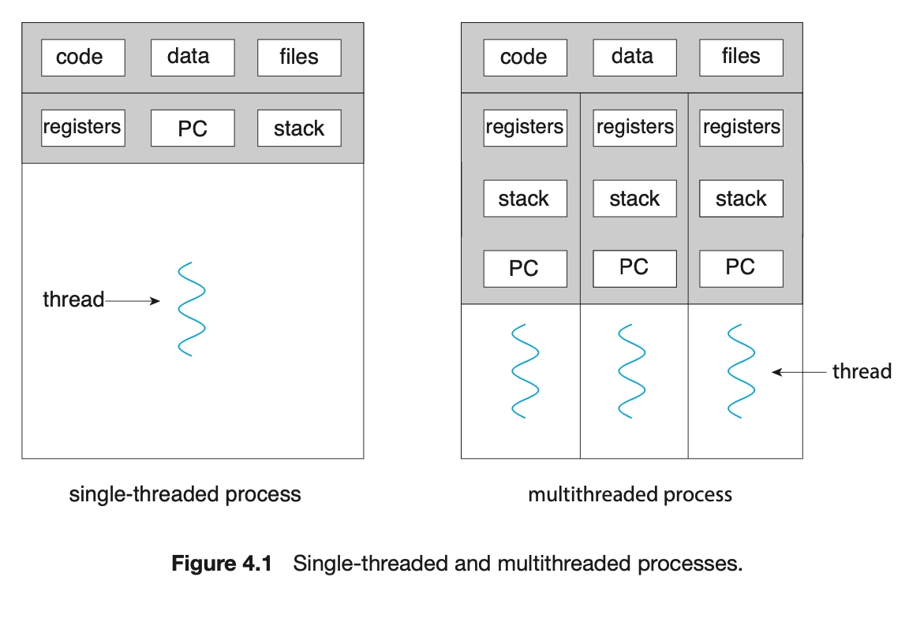
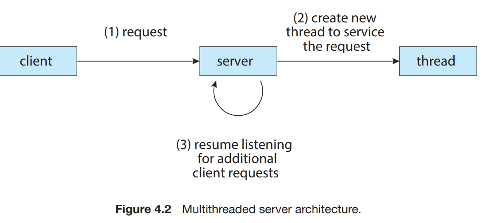
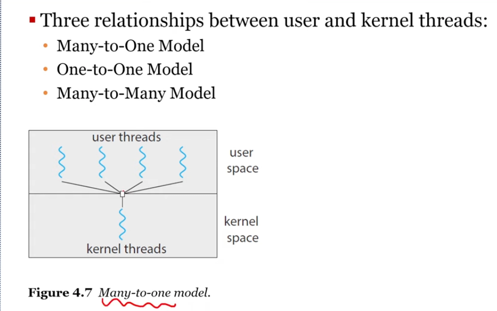

- 이 장의 목표
    - 스레드의 기본 구성요소를 식별하고 스레드와 프로세스를 대조한다.
    - 다중 스레드 프로세스를 설계할 때의 주요 이점과 중대한 과제를 설명한다.
    - 스레드 풀, 포크 조인 및 그랜드 센트럴 디스패치를 포함하여 암시적 스레딩에 대한 다양한 접근 방식을 설명한다.
    - Windows 및 Linux 운영체제가 스레드를 어떻게 나타내는지 설명한다.
    - Pthread, Java 및 Windows 스레딩 API를 사용하여 다중 스레드 응용 프로그램을 설계한다.

## 4.1 개요(Overview)

스레드는 CPU 이용의 기본 단위이다. 스레드는 스레드 ID, 프로그램 카운터(PC), 레지스터 집합, 그리고 스택으로 구성된다. 스레드는 같은 프로세스에 속한 다른 스레드와 코드, 데이터 섹션, 그리고 열린 파일이나 신호와 같은 운영체제 자원들을 공유한다. 전통적인 프로세스는 하나의 제어 스레드를 가지고 있다. 만일 프로세스가 다수의 제어 스레드를 가진다면, 프로세스는 동시에 하나 이상의 작업을 수행할 수 있다.

### 4.1.1 동기(Motivation)

현대의 컴퓨터와 모바일 기기에서 작동하는 거**의 모든 소프트웨어 응용들은 다중 스레드를 이용**한다.

- 이미지 모음에서 사진 축소판을 만드는 응용 프로그램은 별도의 스레드를 사용하여 개별 이미지에서 축소판을 생성할 수 있다.
- 웹 브라우저는 하나의 스레드가 이미지 또는 텍스트를 표시하고 다른 스레드는 네트워크에서 데이터를 검색하도록 할 수 있다.
- 워드 프로세서에는 그래픽을 표시하는 스레드, 사용자의 키 입력에 응답하는 또 다른 스레드 및 백그라운드에서 맞춤법 및 문법 검사를 수행하는 세 번째 스레드가 있을 수 있다.



하나의 응용 프로그램이 여러 개의 비슷한 작업을 수행할 필요가 있는 상황들이 또한 있다. 만약 웹 서버가 전통적인 단일 스레드 프로세스로 작동한다면, 자신의 단일 프로세스로 한 번에 하나의 클라이언트만 서비스할 수 있게 되어 클라이언트는 자신의 요구가 서비스되기까지 매우 긴 시간을 기다려야 한다.

하나의 해결책은 서버가 요청을 받아들이는 하나의 프로세스로 동작하게 하는 것이다. 즉, 서버에게 서비스 요청이 들어오면, 프로세스는 그 요청을 수행할 별도의 프로세스를 생성하는 것이다. 사실 이와 같은 방식으로 프로세스를 생성하는 것은 스레드가 대중화되기 전에는 매우 보편적이었다. 프로세스 생성 작업은 매우 많은 시간을 소비하고 많은 자원을 필요로 하는 일이다. 하지만 새 프로세스가 해야 할 일이 기존 프로세스가 하는 일과 동일하다면 왜 이 많은 오버헤드를 감수해야 하는가?

대부분의 경우 그렇게 하는 것보다는 프로세스 안에 여러 스레드를 만들어 나가는 것이 더 효율적이다.

(웹 서버가 다중 스레드화 되면, 서버는 클라이언트의 요청을 listen 하는 별도의 스레드를 생성한다.)





대부분의 운영체제 커널도 일반적으로 다중 스레드이다. 예를 들어 Linux 시스템에서 시스템을 부트하는 동안 여러 커널 스레드가 생성된다. 각 스레드는 장치 관리, 메모리 관리 또는 인터럽트 처리와 같은 특정 작업을 수행한다. 많은 응용 프로그램도 기본 정렬, 트리 및 그래프 알고리즘을 포함하여 다중 스레드를 활용할 수 있다. 또한, 데이터 마이닝, 그래픽 및 인공지능에서 CPU 중심의 최신 문제를 해결해야 하는 프로그래머는 병렬로 실행되는 솔루션을 설계하여 최신 다중 코어 시스템의 성능을 활용할 수 있다.

### 4.1.2 장점(Benefits)

다중 스레드 프로그래밍의 이점은 다음의 4가지 큰 부류로 나눌 수 있다.

1. 응답성(responsiveness): 대화형 응용을 다중 스레드화하면 응용 프로그램의 일부분이 봉쇄되거나, 응용 프로그램이 긴 작업을 수행하더라도 프로그램의 수행이 계속되는 것을 허용함으로써, 사용자에 대한 응답성을 증가시킨다.
2. 자원 공유(resource sharing): 프로세스는 공유 메모리와 메시지 전달 기법을 통하여만 자원을 공유할 수 있다. 이러한 기법은 프로그래머에 의해 명시적으로 처리되어야 한다. 그러나 스레드는 자동으로 그들이 속한 프로세스의 자원들과 메모리를 공유한다. 코드와 데이터 공유의 이점은 한 응용 프로그램이 같은 주소 공간 내에 여러 개의 다른 작업을 하는 스레드를 가질 수 있다는 점이다.
3. 경제성(economy): 프로세스 생성을 위해 메모리와 자원을 할당하는 것은 비용이 많이 든다. 스레드는 자신이 속한 프로세스의 자원들을 공유하기 때문에, 스레드를 생성하고 문맥 교환하는 것이 더욱더 경제적이다. 문맥 교환은 일반적으로 프로세스 사이보다 스레드 사이에서 더 빠르다.
4. 규모 적응성(scalability): 다중 스레드의 이점은 다중 처리기 구조에서 더욱 증가할 수 있다. 다중 처리기 구조에서는 각각의 스레드가 다른 처리기에서 병렬로 수행될 수 있기 때문이다.

## 4.2 다중 코어 프로그래밍(Multicore Programming)

컴퓨터 설계의 역사 초기에 더 좋은 컴퓨팅 성능에 대한 요구에 부응하여 단일 CPU 시스템은 다중 CPU 시스템으로 발전했다. 나중의 비슷한 시스템 설계 추세는 단일 컴퓨팅 칩에 여러 컴퓨팅 코어를 배치하는 것이다. 각 코어는 운영체제에 별도의 CPU로 보인다. 이러한 시스템을 다중 코어라고 하며 다중 스레드 프로그래밍은 이러한 여러 컴퓨팅 코어를 보다 효율적으로 사용하고 병행성을 향상시키는 기법을 제공한다.

현재 논의에서 병행성과 병렬성의 차이점에 주목하라. 병행 시스템은 모든 작업이 진행되게 하여 둘 이상의 작업을 지원한다. 이에 반해 병렬 시스템은 둘 이상의 작업을 동시에 수행할 수 있다.

### 4.2.1 프로그래밍 도전과제(Programming Challenge)

다중 코어 시스템으로 발전하는 추세는 시스템 설계자뿐 아니라 응용 프로그래머에게도 다중 코어의 활용도를 높일 수 있도록 압력을 행사하고 있다. 운영체제 설계자는 그림 4.4에 보인 병렬 수행이 될 수 있도록 여러 코어를 활용하는 스케줄링 알고리즘을 개발해야 한다.

일반적으로 다중 코어 시스템을 위해 프로그래밍하기 위해서는 5개의 극복해야 할 도전 과제가 있다.

<aside>

**Amdahl’s Law**

프로그램에는 병렬화(또는 개선)할 수 있는 부분과 순차적으로 실행될 수밖에 없는 부분이 있는데, 아무리 개선 가능한 부분을 빠르게 만들어도 **개선 불가능한 부분이 전체 성능 향상의 상한선을 결정한다**는 것.

</aside>

1. 테스크 인식(identifying tasks). 응용을 분석하여 독립된 병행 가능 태스크로 나눌 수 있는 영역을 찾는 작업이 필요하다. 이상적으로 태스크는 서로 독립적이고 따라서 개별 코어에서 병렬 실행될 수 있어야 한다.
2. 균형(balance): 병렬로 실행될 수 있는 태스크를 찾아내는 것도 중요하지만 찾아진 부분들이 전체 작업에 균등한 기여도를 가지도록 태스크로 나누는 것도 매우 중요하다.
3. 데이터 분리(data spliting). 응용이 독립된 테스크로 나누어지는 것처럼, 테스크가 접근하고 조작하는 데이터 또한 개별 코어에서 사용할 수 있도록 나누어져야 한다.
4. 데이터 종속성(data dependency): 테스크가 접근하는 데이터는 둘 이상의 테스크 사이에 종속성이 없는지 검토되어야 한다. 한 테스크가 다른 테스크로부터 오는 데이터에 종속적인 경우에는 프로그래머가 데이터 종속성을 수용할 수 있도록 테스크의 수행을 잘 동기화해야 한다. 그러한 전략에 대해서는 6장에서 검토한다.
5. 시험 및 디버깅

### 4.2.2 병렬 실행의 유형(Types of Parallelism)

일반적으로 데이터 병렬 실행과 테스크 병렬 실행의 두 가지 유형이 존재한다.

데이터 병렬 실행은 동일한 데이터의 부분집합을 다수의 계산 코어에 분배한 뒤 각 코어에서 동일한 연산을 실행하는 데 초점을 맞춘다. 예를 들어 크기가 N인 배열의 내용을 더하는 경우를 생각해 보자. 단일 코어 시스템에서는 하나의 스레드가 원소 [0]부터 [N-1]를 더하면 된다. 그러나 듀얼 코어 시스템에서는 코어 0에서 실행되는 스레드 A는 원소 [0]부터 [N/2 - 1]까지 더하고 코어 1에서 실행되는 스레드 B는 원소 [N/2]부터 [N-1]까지 더할 수 있다. 두 스레드는 각자 계산 코어에서 병렬로 실행된다.

테스크 병렬 실행은 데이터가 아니라 테스크(스레드)를 다수의 코어에 분배한다. 각 스레드는 고유의 연산을 실행한다.

## 4.3 다중 스레드 모델(Multithreading Models)

우리는 지금까지 일반적 의미에서의 스레드를 다루어 왔다. 그러나 스레드를 위한 지원은 사용자 스레드(user threads)를 위해서는 사용자 수준에서, 또는 커널 스레드(kernel threads)를 위해서는 커널 수준에서 제공된다. 사용자 스레드는 커널 위에서 지원되며 커널의 지원 없이 관리된다. 반면에 커널 스레드는 운영체제에 의해 직접 지원되고 관리된다. Windows, Linux, macOS를 포함한 거의 모든 현대 운영체제들은 커널 스레드를 지원한다.

궁극적으로 사용자 스레드와 커널 스레드는 어떤 연관 관계가 존재해야 한다. 이 절에서는 이 연관 관계를 확립하는 세 가지 일반적인 방법인 다대일, 일대일, 다대다 모델을 살펴본다.



### 4.3.1 다대일 모델(Many-to-One Model)

한 스레드가 봉쇄형 시스템 콜을 할 경우, 전체 프로세스가 봉쇄된다. 또한, 한 번에 하나의 스레드만이 커널에 접근할 수 있기 때문에, 다중 스레드가 다중 코어 시스템에서 병렬로 실행될 수 없다. 다중 처리 코어의 이점을 살릴 수 없기 때문에 이 모델을 사용 중인 시스템은 거의 존재하지 않는다.

### 4.3.2 일대일 모델(One-to-One Model)

일대일 모델은 각 사용자 스레드를 각각 하나의 커널 스레드로 사상한다. 이 모델은 하나의 스레드가 봉쇄적 시스템 콜을 호출하더라도 다른 스레드가 실행될 수 있기 때문에 다대일 모델보다 더 많은 병렬성을 제공한다. 이 모델의 유일한 단점은 사용자 스레드를 만들려면 해당 커널 스레드를 만들어야 하며 많은 수의 커널 스레드가 시스템 성능에 부담을 줄 수 있다는 것이다. Linux는 Windows 운영체제 제품군과 함게 일대일 모델을 구현한다.

### 4.3.3 다대다 모델(Many-to-Many Model)

다대다 모델은 여러 개의 사용자 수준 스레드를 그보다 작은 수, 혹은 같은 수의 커널 스레드로 멀티플렉스한다. 커널 스레드의 수는 응용 프로그램이나 특정 기계에 따라 결정된다.

다대일 모델은 개발자가 원하는 만큼의 사용자 수준 스레드를 생성하도록 허용하지만, 커널은 한 번에 하나의 커널 스레드만 스케줄 할 수 있기 때문에 진정한 병렬 실행을 획득할 수 없다. 일대일 모델은 더 많은 병행 실행을 제공하지만, 개발자가 한 응용 내에 너무 많은 스레드를 생성하지 않도록 주의해야 한다. 다대다 모델은 이러한 두 가지의 단점들을 어느정도 해결했다. 개발자는 필요한 만큼 많은 사용자 수준 스레드를 생성할 수 있다. 그리고 상응하는 커널 스레드가 다중 처리기에서 병렬로 수행될 수 있다. 또한, 스레드가 봉쇄형 시스템 콜을 발생시켰을 때, 커널이 다른 스레드의 수행을 스케줄 할 수 있다.

결과적으로 대부분의 운영체제는 이제 일대일 모델을 사용한다.

## 4.4 스레드 라이브러리(Threads Library)

스레드 라이브러리(threads library)는 프로그래머에게 스레드를 생성하고 관리하기 위한 API를 제공한다. 스레드 라이브러리를 구현하는 데에는 주된 두 가지 방법이 있다.

첫 번째 방법은 커널의 지원 없이 완전히 사용자 공간에서만 라이브러리를 제공하는 것이다. 라이브러리를 모든 코드와 자료구조는 사요자 공간에 존재한다. 라이브러리의 함수를 호출하는 것은 시스템 콜이 아니라 사용자 공간의 지역 함수를 호출하게 된다는 것을 의미한다.

두 번째 방법은 운영체제에 의해 지원되는 커널 수준 라이브러리를 구현하는 것이다. 이 경우, 라이브러리를 위한 코드와 자료구조는 커널 공간에 존재한다. 라이브러리 API를 호출하는 것은 커널 시스템 콜을 부르는 결과를 낳는다.

현재 POSIX Pthreads, Windows 및 Java의 세 종류 라이브러리가 주로 사용된다.

Java 스레드 API는 Java 프로그램에서 직접 스레드 생성과 관리를 가능하게 한다. 그러나 대부분의 JVM 구현은 호스트 운영체제에서 실행되기 때문에 Java 스레드 API는 통상 호스트 시스템에서 사용 가능한 스레드 라이브러리를 이용하여 구현된다.

다수의 스레드를 생성하는 일반적인 전략 두 가지

- 비동기 스레딩
  - 부모가 자식 스레드를 생성한 후 부모는 자신의 실행을 재개하여 부모와 자식 스레드가 서로 독립적으로 병행하게 실행된다. 스레드가 독립적이기 때문에 스레드 사이의 데이터 공유는 거의 없다.
- 동기 스레딩
  - 부모 스레드가 하나 이상의 자식 스레드를 생성하고 자식 스레드 모두가 종료할 때까지 기다렸다가 자신의 실행을 재개하는 방식을 말한다. 여기서 부모가 생성한 스레드는 병행하게 실행되지만 부모는 자식들의 작업이 끝날 때까지 실행을 계속할 수 없다. 부모 스레드는 오직 모든 자식 스레드가 조인한 후에야 실행을 재개할 수 있다. 통상 동기 스레딩은 스레드 사이의 상당한 양의 데이터 공유를 수반한다. 예를 들어 부모 스레드는 자식들이 계산한 결과를 통합할 수 있다.

<aside>

스프링 톰캣은 동기 스레드 이면서 멀티 스레드 방식

</aside>

### 4.4.1 Pthreads

Pthreads는 POSIX가 스레드 생성과 동기화를 위해 제정한 표준 API이다. 이것은 스레드의 동작에 관한 명세일 뿐이지 그것 자체를 구현한 것은 아니다. 이 명세를 가지고 운영체제 설계자들은 그들 나름대로 그것을 구현할 수 있다. Linux와 macOS를 포함한 많은 시스템이 Pthreads 명세를 구현하고 있다. Windows는 자체적으로 Pthreads를 지원하지 않더라도 타사가 구현한 버전을 구할 수 있다.

Pthreads 프로그램에서 별도의 스레드는 지정된 함수에서 실행을 시작한다. 이 프로그램이 실행을 시작하면 하나의 제어 스레드가 main() 함수에서 시작한다. 약간의 초기화 후에 main()은 runner() 함수에서 실행을 시작하는 두 번째 스레드를 생성한다. 두 스레드는 전역 변수 sum을 공유한다.

### 4.4.3 Java 스레드

스레드는 Java 프로그램의 프로그램 실행의 근본적인 모델이고, Java 언어와 API는 스레드의 생성과 관리를 지원하는 풍부한 특성을 제공한다. 모든 Java 프로그램은 적어도 하나의 단일 제어 스레드를 포함하고 있다. 단지 main() 함수로만 이루어진 단순한 Java 프로그램조차 JVM 내의 하나의 단일 스레드로 수행된다. Java 스레드는 JVM을 제공하는 어떠한 시스템에서도 사용할 수 있다. JVM을 제공하는 시스템에는 Windows, Linux, macOS 등이 포함된다.

Java 프로그램에서 스레드를 명시적으로 생성하는 데에는 두 가지 기법이 있다. 한 가지 방법은 Thread 클래스에서 파생된 새 클래스를 만들고 run() 메소드를 재정의하는 것이다. **대안(보다 일반적으로 사용되는) 기법은 Runnable 인터페이스를 구현하는 클래스를 정의하는 것이다.** 이 인터페이스는 public void run()의 서명을 가진 단일 추상 메소드를 정의한다. Runnable을 구현하는 클래스의 run() 메소드 코드는 별도의 스레드에서 실행된다. 사용 예는 다음과 같다.

```java
class Task implements Runnable 
{
		public void run() {
				System.out.println("I am a thread.");
		}
}
```

Java에서 스레드를 생성하려면 Thread 객체를 생성하고 Runnable을 구현하는 클래스의 인스턴스를 전달한 다음 Thread 객체의 start() 메소드를 호출해야 한다. 이 순서가 다음에 나와 있다.

```java
Thread worker = new Thread(new Task());
worker.start();
```

새 Thread 객체에 대해 start() 메소드를 호출하면 두 가지 작업이 수행된다.

1. 메모리가 할당되고, JVM 내에 새로운 스레드가 초기화된다.
2. run() 메소드를 호출하면 스레드가 JVM에 의해 수행될 자격을 갖게 한다.

Java의 join() 메소드는 (Pthreads 및 Windows 라이브러리의 부모 스레드가 각 스레드가 완료되기를 기다렸다가 계속 진행)하는 것과 유사한 기능을 제공한다.

```java
try {
		worker.join();
}
catch (InterruptedException ie) {}
```

부모가 여러 스레드가 완료되기를 기다려야 하는 경우 join() 메소드는 그림 4.12의 Pthread에 보인 것과 비슷한 for 루프로 묶을 수 있다.

**4.4.3.1 Java Executor 프레임워크**

Java는 처음부터 지금까지 설명한 방식을 사용하여 스레드 생성을 지원하였다. 그러나 버전 1.5와 API부터 Java는 개발자에게 스레드 생성 및 통신에 대한 제어 기능을 크게 향상시키는 몇 가지 새로운 병행 처리 기능을 도입하였다. 이 도구는 java.util.concurrent 패키지에서 사용할 수 있다.

Thread 객체를 명시적으로 생성하는 대신 Executor 인터페이스를 중심으로 스레드 생성을 구성한다.

```java
public interface Executor
{
		void execute(Runnable command);
}
```

이 인터페이스를 구현하는 클래스는 Runnable 객체가 인자로 전달되는 execute() 메소드를 정의해야 한다. Java 개발자에게는 별도의 Thread 객체를 만들고 start() 메소드를 호출하는 대신 Executor를 사용하는 것을 의미한다.

예)

```java
Executor service = new Executor;
service.execute(new Task());
```

Executor 프레임워크는 생산자-소비자 모델을 기반으로 한다. Runnable 인터페이스를 구현하는 작업이 생성되고 이러한 작업을 실행하는 스레드가 이를 소비한다. 이 방법의 장점은 스레드 생성을 실행에서 분리할 뿐만 아니라 병행하게 실행되는 작업 간의 통신 기법을 제공한다는 것이다.

순수한 객체 지향 언어인 Java에는 전역 데이터에 대한 개념이 없다.

~

```java
import java.util.concurrent.*;

class Summation implements Callable<Integer>
{
		private int upper;
		public Summation(int upper) {
				this.upper = upper;
		}
		
		/* The thread will execute in this method */
		public Integer call() {
				int sum = 0;
				for(int i = 1; i <= upper; i++)
						sum += i;
				
				return new Integer(sum);
		}
}

public class Driver
{
		public static void main(String[] args) {
				int upper = Integer.parseInt(args[0]);
				
				ExecutorService pool = Executors.newSingleThreadExecutor();
				Future<Integer> result = pool.submit(new Summation(upper));
				
				try {
						System.out.println("sum = " + result.get());
				} catch (InterruptedException | ExecutionException ie) { }
			}
	}
```

ExecutorService 유형의 newSingleThreadExecutor 객체를 생성하고 submit() 메소드를 사용하여 Callable 태스크를 전달한다. Callable 태스크를 스레드에 제출하면, 스레드가 반환하는 Future 객체이 get() 메소드를 호출하여 결과를 기다린다.

Callable 및 Future를 사용하면 스레드가 결과를 반환할 수 있다.

<aside>

JVM과 호스트 운영체제
→ JVM은 일반적으로 호스트 운영체제 위에 구현된다. 이 설정을 통해 JVM은 하부 운영체제의 구현 세부 사항을 숨기고 Java 프로그램이 JVM을 지원하는 모든 플랫폼에서 작동할 수 있는 일관적이고 추상적인 환경을 제공할 수 있다. JVM 명세는 Java 스레드가 하부 운영체제에 매핑되는 방법을 명시하지 않고 대신 각 JVM의 구현에 맡긴다. 예를 들어, Windows 운영체제는 일대일 모델을 사용한다. 따라서 Windows에서 실행 중인 JVM의 각 Java 스레드는 커널 스레드에 매핑된다.

</aside>

## 4.5 암묵적 스레딩(Implicit Threading)

스레드의 생성과 관리를 프로그래머가 직접 하지 않고, 컴파일러나 런타임 라이브러리에 맡기는 방식을 말합니다. 암묵적 스레딩이라고 불리는 이 전략은 점점 널리 사용되고 있다.

### 4.5.1 스레드 풀

스레드를 무한정 만들면 언젠가는 CPU 시간, 메모리 공간 같은 시스템 자원이 고갈된다. 이러한 문제들을 해결해 줄 수 있는 방법의 하나가 스레드 풀(pool)이다.

스레드 풀의 기본 아이디어는 프로세스를 시작할 때 아예 일정한 수의 스레드들을 미리 풀로 만들어두는 것이다. 이 스레드들은 평소에는 하는 일 없이 일감을 기다리게된다. 서버는 스레드를 생성하지 않고 요청을 받으면 대신 스레드 풀에 제출하고 추가 요청 대기를 재개한다. 풀에 사용 가능한 스레드가 있으면 깨어나고 요청이 즉시 서비스된다. 풀에 사용 가능한 스레드가 없으면 사용 가능한 스레드가 생길 때까지 작업이 대기된다. 스레드가 서비스를 완료하면 풀로 돌아가서 더 많은 작업을 기다린다. 풀에 제출된 작업을 비동기적으로 실행할 수 있는 경우 스레드 풀이 제대로 작동한다.

스레드 풀은 아래와 같은 장점을 가지게 된다.

1. 새 스레드를 만들어 주기보다 기존 스레드로 서비스해 주는 것이 종종 더 빠르다.
2. 스레드 풀은 임의 시각에 존재할 스레드 개수에 제한을 둔다.
3. 테스크를 생성하는 방법을 테스크로부터 분리하면 테스크를 실행을 다르게 할 수 있다.

스레드 풀에 있는 스레드의 개수는 CPU 수, 물리 메모리 용량, 동시 요청 클라이언트 최대 개수 등을 고려하여 정해질 수 있다. 더 정교하게 하려면 풀의 활용도를 보며 동적으로 풀의 크기를 바꿔줄 수도 있다. 그러한 구조는 시스템 부하가 적을 때에는 더 작은 풀을 유지하도록 함으로써 메모리 등의 소모를 더 줄일 수 있다.

**4.5.1.1 Java 스레드 풀(Java Thread Pools)**

### 4.5.2 Fork Join

큰 작업을 재귀적으로 작은 작업으로 쪼개고(fork), 결과를 합침(join).

### 4.5.3 OpenMP

C/C++에서 `#pragma omp parallel for` 같은 지시문만 붙이면 컴파일러가 해당 구간을 병렬화.

—

이상 대표적인 스레드풀 기법들

—

## 4.6 스레드와 관련된 문제들(Threading Issues)

이 절에서는 다중 스레드 프로그램을 설계할 때 고려해야 할 몇 가지 문제들을 논의한다.

### 4.6.1 Fork() 및 Exec() 시스템 콜

우리는 3장에서 fork()가 별도의 복제된 프로세스를 생성하는 데 어떻게 쓰이는지 살펴보았다. 다중 스레드 프로그램에서는 fork()와 exec()의 의미가 달라질 수 있다.

만일 한 프로그램의 스레드가 fork()를 호출하면 새로운 프로세스는 모든 스레드를 복제해야 하는가 아니면 한 개의 스레드만 가지는 프로세스여야 하는가? 몇몇 UNIX 기종은 이 두 가지 버전 fork()를 다 제공한다.

exec() 시스템 콜은 보통 3장에서 기술한 것과 같은 방법으로 수행된다. 즉 어떤 스레드가 exec() 시스템 콜을 부르면 exec()의 매개변수로 지정된 프로그램이 모든 스레드를 포함한 전체 프로세스를 대체시킨다.

두 버전의 fork() 중 어느 쪽을 택할 것인지는 응용 프로그램에 달려있다. fork()를 부르자마자 다시 exec을 부른다면 모든 스레드를 다 복제해서 만들어주는 것은 불필요하다. 왜냐하면 exec에서 지정한 프로그램이 곧 모든 것을 다시 대체할 것이기 때문이다. 이 경우에는 fork() 시스템 콜을 호출한 스레드만 복사해주는 것이 적절하다. 그러나 새 프로세스가 fork() 후 exec을 하지 않는다면 새 프로세스는 모든 스레드들을 복제해야 한다.

### 4.6.2 신호 처리(Signal Handling)

신호는 UNIX에서 프로세스에 어떤 이벤트가 일어났음을 알려주기 위해 사용된다. 신호는 알려줄 이벤트의 근원지나 이유에 따라 동기식 또는 비동기식으로 전달될 수 있다. 동기식이든 비동기식이든 모든 신호는 다음과 같은 형태로 전달된다.

1. 신호는 특정 이벤트가 일어나야 생성된다.
2. 생성된 신호가 프로세스에 전달된다.
3. 신호가 전달되면 반드시 처리되어야 한다.

동기식 신호의 예로는 불법적인 메모리 접근, 0으로 나누기 등이 있다. 실행 중인 프로그램이 이러한 행동을 하면 신호가 발생한다. 동기식 신호는 신호를 발생시킨 연산을 수행한 동일한 프로세스에 전달된다.

신호가 실행 중인 프로세스 외부로부터 발생하면 그 프로세스는 신호를 비동기식으로 전달 받는다.

::

**"멀티스레드 프로세스에서 신호가 오면, 그 신호를 어느 스레드에게 전달해야 하는가?"**

단일 스레드 프로세스에서는 고민할 게 없습니다. 신호가 오면 그냥 그 프로세스(= 유일한 스레드)가 받으면 되니까요. 그런데 스레드가 10개인 프로세스에 신호가 도착하면 문제가 생깁니다. 10개 전부에게 줄까? 하나한테만? 그럼 누구한테?

교재에서는 보통 네 가지 선택지를 제시해요.

1. 신호가 적용될 스레드에게만 전달
2. 프로세스 내 모든 스레드에게 전달
3. 프로세스 내 일부 스레드에게만 전달
4. 특정 스레드가 프로세스의 모든 신호를 받도록 지정

그리고 어떤 방식이 맞는지는 **신호의 종류에 따라 달라집니다.**

**동기식 신호** → 답이 명확합니다. 0으로 나누기를 한 건 특정 스레드니까, 그 짓을 한 **바로 그 스레드**에게 전달하면 돼요.

**비동기식 신호** → 여기가 애매합니다. 예를 들어 Ctrl+C(SIGINT)는 외부에서 "프로세스"를 향해 날아온 거지 특정 스레드를 지목한 게 아니에요. 프로세스 종료 신호라면 모든 스레드에게 보내는 게 맞겠지만, 다른 신호들은 해당 신호를 블록하지 않은 스레드 중 하나에게만 전달하는 식으로 처리합니다.

정리하면, 신호는 원래 **프로세스 단위** 개념으로 설계됐는데 스레드가 등장하면서 "수신자가 여러 명"이 되어버렸고, 그래서 배달 대상을 정하는 문제가 새로 생긴 겁니다. fork()/exec() 문제와 마찬가지로 "프로세스 시절에 만들어진 메커니즘이 멀티스레드 세상에서 재해석이 필요해진 사례"로 4장에서 묶여 나오는 거예요.

### 4.6.3 스레드 취소(Thread Cancellation)

스레드 취소는 스레드가 끝나기 전에 그것을 강제 종료시키는 작업을 일컫는다. 예를 들어 여러 스레드가 데이터베이스를 병렬로 검색하고 있다가 그 중 한 스레드가 결과를 찾았다면 나머지 스레드는 취소되어도 된다.

이처럼 취소되어야 할 스레드를 목적 스레드(target thread)라고 부른다. 목적 스레드의 취소는 다음과 같은 두 가지 방식으로 발생할 수 있다.

1. 비동기식 취소: 한 스레드가 즉시 목적 스레드를 강제 종료시킨다.
2. 지연 취소: 목적 스레드가 주기적으로 자신이 강제 종료 되어야 할지를 점검한다. 이 경우 목적 스레드가 질서정연하게 강제 종료될 수 있다.

스레드 취소를 어렵게 만드는 것은 취소 스레드들에 할당된 자원 문제이다. 또한 스레드가 다른 스레드와 공유하는 자료구조를 갱신하는 도중에 취소 요청이 와도 문제가 된다.

### 4.6.4 스레드-로컬 저장장치

한 프로세스에 속한 스레드들은 그 프로세스의 데이터를 모두 공유한다. 이는 다중 스레드 프로그래밍의 큰 장점 중 하나이다. 그러나 상황에 따라서는 각 스레드가 자기만 엑세스할 수 있는 데이터를 가져야 할 필요도 있다. 그러한 데이터를 스레드-로컬 저장장치(TLS)라고 부른다.

### 4.6.5 스케줄러 액티베이션

예를 들어 어떤 사용자 스레드가 블로킹 I/O를 호출하면, 그 스레드를 실행하던 커널 스레드도 같이 블록됩니다. 그러면 그 LWP에 올라탈 예정이던 다른 사용자 스레드들은 실행 가능한 상태인데도 실행할 "발판"이 없어서 멍하니 기다리게 돼요. 커널이 이 사실을 라이브러리에 알려주지 않으면 라이브러리는 대응할 방법이 없습니다.

### 4.7.2 Linux 스레드

**.프로세스와 스레드를 구분하지 않음 — clone()**

리눅스는 커널 내부에서 프로세스와 스레드를 구분하지 않고 전부 태스크라고 부릅니다. 그리고 fork() 대신 `clone()` 시스템 콜 하나로 둘 다 만들어요. 차이는 **플래그로 부모와 무엇을 공유할지 지정**하는 것뿐입니다.

- `clone()`에 `CLONE_VM`(주소 공간), `CLONE_FS`(파일 시스템 정보), `CLONE_FILES`(열린 파일), `CLONE_SIGHAND`(시그널 핸들러) 등을 켜서 호출 → 부모와 거의 다 공유 → 사실상 **스레드** 생성
- 아무것도 공유하지 않고 호출 → fork()와 동일 → **프로세스** 생성