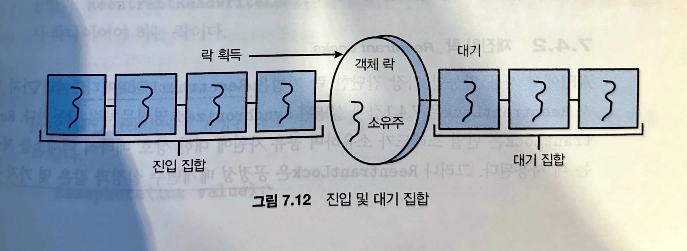

시스템은 일반적으로 병행하게 또는 병렬로 실행되는 수백 개 또는 수천 개의 스레드로 구성된다. 스레드는 종종 사용자 데이터를 공유한다. 한편 운영체제는 다양한 자료구조를 지속적으로 업데이트하여 여러 스레드를 지원한다. 공유 데이터에 대한 액세스가 제어되지 않으면 경쟁 조건이 존재하여 데이터 값이 손상될 수 있다.

프로세스 동기화는 경쟁 조건을 피하고자 공유 데이터에 대한 액세스를 제어하는 도구를 사용한다. 이러한 도구를 잘못 사용하면 교착 상태를 포함한 시스템 성능이 저하될 수 있으므로 주의해서 사용한다.

- 협력적 프로세스
    - 시스템 내에서 실행 중인 다른 프로세스의 실행에 영향을 주거나 영향을 받는 프로세스
    - 논리 주소 공간을 직접 공유하거나 공유 메모리 또는 메시지 전달을 통해서만 데이터를 공유할 수 있다(데이터 일관성 문제)
        - 논리 주소 공간을 공유하는 협력적 프로세스의 질서 있는 실행을 보장하여 일관성을 유지해야함

<aside>

이 장의 목표

- 임계구역 문제를 설명하고 경쟁 조건을 설명한다.
- 메모리 장벽, compare-and-swap 연산 및 원자적 변수를 사용하여 임계구역 문제에 대한 하드웨어 해결책을 설명한다.
- Mutex 락, 세마포, 모니터 및 조건 변수를 사용하여 임계구역 문제를 해결하는 방법을 보인다.
- 적은, 중간 및 심한 경쟁 시나리오에서 임계구역 문제를 해결하는 도구를 평가한다.
</aside>

## 6.1 배경(Background)

<aside>

T0: producer execute register1 = count {register1 = 5}

T1: producer execute register1 = register1 + 1 {register1=6}

T2: consumer execute register2=count {register2=5}

T3: consumer execute register2=register2-1 {register2=4}

T4: producer execute count=register1 {count=6}

T5: consumer execute count=register2 {count=4}

</aside>

실제로 5개의 버퍼가 채워져 있지만 4개의 버퍼가 채워져 있는 것을 의미하는 “count == 4”인 부정확한 상태에 도달하게 된다. T4와 T5의 문장 순서를 바꾸면 “count == 6”인 부정확한 상태에 도달한다.

- 경쟁 상황(race condition)
    - 실행 결과가 접근이 발생한 특정 순서에 의존하는 상황
    - 우리는 한순간에 하나의 프로세스만이 변수 count를 조작하도록 보장해야 한다.
        - 어떤 형태로든 프로세스들이 동기화되도록 할 필요가 있다

## 6.2 임계구역 문제(The Critical-Section Problem)

- 임계구역(critical section): 적어도 하나 이상의 다른 프로세스와 공유하는 데이터에 접근하고 갱신할 수 있다.
- 한 프로세스가 자신의 임계구역에서 수행하는 동안에는 다른 프로세스들은 그들의 임계구역에 들어갈 수 없다.

- **임계구역 문제에 대한 해결안**
    1. 상호 배제(mutual exclusion): 프로세스 P1가 자기의 임계구역에서 실행된다면, 다른 프로세스들은 그들 자신의 임계구역에서 실행될 수 없다.
    2. 진행(progress): 자기의 임계구역에서 실행되는 프로세스가 없고 그들 자신의 임계구역으로 진입하려고 하는 프로세스들이 있다면, 나머지 구역에서 실행중이지 않은 프로세스들만 다음에 누가 그 임계구역으로 진입할 수 있는지를 결정하는 데 참여할 수 있으며, 이 선택은 무한정 연기될 수 없다.
    3. 한정된 대기(bounded waiting): 프로세스가 자기의 임계구역에 진입하려는 요청을 한 후부터 그 요청이 허용될 떄까지 다른 프로세스들이 그들 자신의 임계구역에 진입하도록 허용되는 횟수에 한계가 있어야 한다.

- 단일 코어 환경
    - 공유 변수를 수정하는 동안 인터럽트가 발생하는 것을 막을 수 있다면 임계구역 문제는 간단히 해결될 수 있다.
    - 선점 없이 순서대로 실행할 수 있다는 것을 확신할 수 있다.
- 다중 처리기 환경
    - 다중 처리기에서 인터럽트를 비활성화하면 시간이 많이 걸릴 수 있다.
    - 메시지가 모든 프로세서에 전달되는데 이 메시지 전달은 각 임계구역으로의 진입을 지연시키고 시스템 효율성을 떨어뜨린다.

운영체제 내에서 임계구역을 다루기 위해서 선점형 커널과 비선점형 커널의 두 가지 일반적인 접근법이 사용된다.

- 선점형 커널
    - 프로세스가 커널 모드에서 수행되는 동안 선점되는 것을 허용한다.
- 비선점형 커널
    - 커널 모드에서 수행되는 프로세스의 선점을 허용하지 않고 커널 모드 프로세스는 커널을 빠져나갈 때까지 또는 봉쇄될 때까지 또는 자발적으로 CPU의 제어를 양보할 때까지 계속 수행된다.

## 6.3 Peterson의 해결안

- 임계구역과 나머지 구역을 번갈아 가며 실행하는 두 개의 프로세스로 한정
- 두 프로세스가 두 개의 데이터 항목을 공유하도록 하여 해결

    ```java
    int turn;
    boolean flag[2];
    ```


(상호 배제를 유지하는 유일한 방법은 적절한 동기화 도구를 사용하는 것이다.)

## 6.4 동기화를 위한 하드웨어 지원(Hardware Support for Synchronization)

### 6.4.1 메모리 장벽(Memory Barriers)

컴퓨터 아키텍처가 응용 프로그램에게 제공하는 메모리 접근 시 보장되는 사항을 결정한 방식을 메모리 모델이라고 한다.

1. 강한 순서.

   한 프로세서의 메모리 변경 결과가 다른 모든 프로세서에 즉시 보임.

2. 약한 순서.

   한 프로세서의 메모리 변경 결과가 다른 프로세서에 즉시 보이지 않음.

- 메모리 장벽(또는 메모리 펜스)
    - 메모리의 모든 변경 사항을 다른 모든 프로세서로 전파하는 명령어를 제공하여 다른 프로세서에서 실행 중인 스레드에 메모리 변경 사항이 보이는 것을 보장하는 것.
    - 메모리 장벽은 향후 적재 또는 저장 작업이 수행되기 전에 저장 작업이 메모리에서 완료되어 다른 프로세서에 보이도록 한다.

### 6.4.2 하드웨어 명령어(Hardware Instructions)

word의 내용을 검사하고 변경하거나, 두 워드의 내용을 원자적으로 교환(swap)할 수 있는, 즉 인터럽트 되지 않는 하나의 단위로서, 특별한 하드웨어 명령어들을 제공한다. 우리는 이들 특별한 명령어들을 사용하여 임계구역 문제를 상대적으로 간단한 방식으로 해결할 수 있다.

### 6.4.3 원자적 변수(Atmoic Variables)

- 정수 및 bool과 같은 기본 데이터 유형에 대한 원자적 연산을 제공한다.
- 원자적 변수는 원자적 갱신을 제공하지만 모든 상황에서 경쟁 조건을 완벽히 해결하지 않는다.
    - 생산자와 소비자 프로세스에서 두 소비자가 하나의 생산 count를 두고 둘 다 소비하려 하는 경우
- 원자적 변수는카운터 및 시퀀스 생성기와 같은 공유 데이터 한 개의 갱신에만 제한되는 경우가 많다.

## 6.5 Mutex Locks

- 임계구역 문제를 해결하기 위한 상위 수준 소프트웨어 도구 중 가장 간단한 도구
- mutual exclusion 의 축약 형태
- 프로세스는 임계구역에 들어가기 전에 반드시 락을 획득해야 하고 임계구역을 빠져나올 때 락을 반환해야 한다.
- Mutex 락은 `available`이라는 boolean 변수를 갖는데 이 변수 값이 락의 가용 여부를 표시

- 바쁜 대기(busy waiting)
    - 프로세스가 임계구역에 있는 동안 임계구역에 들어가기를 원하는 다른 프로세스들은 `acquire()` 함수를 호출하는 반복문을 계속 실행해야 한다.
    - 바쁜 대기는 다른 프로세스가 생산적으로 사용할 수 있는 CPU 주기를 낭비한다.

<aside>

락 경합

락에 대한 경합 상태일 수도 비경합 상태일 수도 있다. 락을 획득하려고 시도하는 동안 스레드가 봉쇄되면 락은 경합 상태로 간주한다. 스레드가 락을 얻으려고 시도할 때 락을 사용할 수 있으면 락은 비경합 상태로 간주한다.
높은 경합 상태(비교적 많은 수의 스레드가 락을 획득하려고 시도하는중)은 병행 실행 응용 프로그램의 성능을 전체적으로 저하한다.

</aside>

<aside>

“짧은 기간”이란 무엇을 의미하는가?

→ 스핀락은 락이 짧은 기간 동안 유지될 때 다중 처리기 시스템에서 선택하는 락 기법으로 종종 인식된다. 그러나 정확히 짧은 기간은 어떤 구간을 의미하는가? 락을 기다리는 스레드는 2번의 문맥 교환이 필요하다. 첫 번째는 스레드를 대기 상태로 옮기기 위한 문맥 교환이고 두 번째는 락이 사용 가능해지면 대기 중인 스레드를 복원하기 위한 문맥 교환이다. 일반적인 규칙은 락이 유지되는 기간이 문맥 교환을 두 번 하는 시간보다 짧은 경우 스핀락을 사용하는 것이다.

</aside>

- 스핀락(spinlock)
    - 락을 사용할 수 있을 때까지 프로세스가 “회전”하기 때문
    - 최신 다중 코어 컴퓨팅 시스템에서 스핀락은 많은 운영체제에서 널리 사용된다.

## 6.6 세마포(Semaphores)

- 세마포 S는 공유 자원의 갯수를 나타내는 정수 변수
- 초기화를 제외하고 단지 두 개의 표준 원자적 연산 wait()와 signal()로만 접근할 수 있다.
    - wait(): 검사하다
    - signla(): 증가하다
- 세마포의 정수 값을 변경하는 연산은 반드시 원자적으로 수행되어야 한다

### 6.6.1 세마포 사용법(Semaphore Usage)

- 카운팅 세마포
    - 제한 없는 영역을 갖는다.
- 이진 세마포
    - 0과 1 사이의 값만 가능하다.
    - mutex락과 유사하게 작동한다.


```java
wait(S) {
		while (S <= 0)
				; // busy wait
		S--;
}
```

```java
signal(S) {
		S++;
}
```

### 6.6.2 세마포 구현(Semaphore Implementation)

- 프로세스가 wait() 연산을 실행하고 세마포 값이 양수가 아닌 것을 발견하면, 프로세스는 반드시 대기해야 한다.
- 바쁜 대기 대신에 프로세스는 자신을 **일시 중지**시킬 수 있다.
- 일시 중지 연산은 프로세스를 세마포에 연관된 대기 큐에 넣고, 프로세스의 상태를 대기 상태로 전환한다.
    - signal(): 다른 프로세스가 이 연산을 실행하면 일시 중지된 프로세스는 재시작되어야 한다.
    - wakeup(): 프로세스의 상태를 대기상태에서 준비 완료 상태로 변경한다.그리고 프로세스는 준비 완료 큐에 넣어진다

## 6.7 모니터(Monitors)

- mutex 락과 세마포를 이용하여 임계구역 문제를 해결할 때 프로그래머가 세마포를 잘못 사용하면 다양한 유형의 오류가 너무나도 쉽게 발생할 수 있다.
- 간단한 동기화 도구를 통합하여 고급 언어 구조물을 제공하는 것이 모니터

## 7.4 Java에서의 동기화(Synchronization in Java)

### 7.4.1 Java 모니터(Java Monitors)

- Java의 모든 객체는 하나의 락과 연결되어 있다.
- synchronized로 선언된 경우 메소드를 호출하려면 그 객체와 연결된 락을 획득해야 한다.
- 다른 스레드가 이미 락을 소유한 경우 synchronized 메소드를 호출한 스레드는 봉쇄되어 객체의 락에 설정된 진입 집합(entry set)에 추가된다.
- 락이 해제될 때 락에 대한 진입 집합이 비어있지 않으면 JVM은 이 집합에서 락 소유자가 될 스레드를 임의로 선택한다.

락을 갖는 것 외에도 모든 객체는 스레드 집합으로 구성된 **대기 집합**과 연결된다.

- 스레드는 특정 조건이 충족되지 않아 계속할 수 없다고 결정할 수 있다.
    - 예를 들어, 생산자가 insert() 메소드를 호출했는데 버퍼가 가득 찬 경우에 발생한다.
      그러면 스레드는 락을 해제하고 계속할 수 있는 조건이 충족될 때까지 기다린다.

<aside>

전체 메소드를 동기화하는 것보다 공유 데이터를 조작하는 코드 블록만 동기화하는 것이 너무 큰 락 범위를 방지할 수 있다. Java는 synchronized 메소드를 선언하는 것 외에도 블록 동기화를 허용한다. 임계구역 코드에 액세스 하려면 이 객체에 대한 객체 락 소유권이 필요하다.

</aside>

- 스레드가 wait() 메소드를 호출하면 다음이 발생한다.
    - 스레드가 객체의 락을 해제한다.
    - 스레드 상태가 봉쇄됨으로 설정된다.
    - 스레드는 그 객체의 대기 집합에 넣어진다.

그림 7.11의 예를 고려하자. 생산자가 insert() 메소드를 호출하고 버퍼가 가득 찬걸 확인하면 wait() 메소드를 호출한다. 이 호출은 락을 해제하고 생산자를 봉쇄하여 생산자를 개체의 대기 집합에 둔다. 생산자가 락을 해제했기 때문에 소비자는 궁극적으로 remove() 메소드로 진입하여 생산자를 위한 버퍼의 공간을 비운다.

소비자 스레드는 생산자가 이제 진행할 수 있다는 것을 어떻게 알리는가? 보통 스레드가 `synchronized` 메소드를 종료하면 이탈 스레드는 객체와 연결된 락만 해제하여 진입 집합에서 스레드를 제거하고 락 소유권을 넘겨준다. 그러나, insert() 및 remove() 메소드의 끝에서 우리는 notify() 메소드를 호출한다.

notify() 메소드는 다음과 같은 일을 한다.

1. 대기 집합의 스레드 리스트에서 임의의 스레드 T를 선택한다.
2. 스레드 T를 대기 집합에서 진입 집합으로 이동한다.
3. T의 상태를 봉쇄됨에서 실행 가능으로 설정한다.



T는 이제 다른 스레드와 락 경쟁을 할 수 있다. T가 락 제어를 다시 획득하면 wait() 호출에서 복귀하여 count 값을 다시 확인할 수 있다.

- 생산자는 insert() 메소드를 호출하고 락이 사용 가능한지 확인한 후 메소드로 진입한다. 메소드에 들어가면 생산자는 버퍼가 가득 찼음을 확인하고 wait()를 호출한다. wait() 호출은 객체 락을 해제하고 생산자 상태를 봉쇄됨으로 설정하고 생산자를 객체의 대기 집합에 둔다.
- 소비자는 이제 객체에 대한 락을 사용할 수 있으므로 remove() 메소드를 호출하고 진입한다. 소비자는 버퍼에서 항목을 제거하고 notify()를 호출한다. 소비자는 여전히 개체에 대한 락을 소유하고 있다.
- notify() 호출은 객체의 대기 집합에서 생산자를 제거하고 생산자를 진입 집합으로 이동하고 생산자의 상태를 실행 가능으로 설정한다.
- 소비자가 remove() 메소드를 종료한다. 이 메소드를 종료하면 객체의 락이 해제된다.
- 생산자가 락을 다시 얻으려고 시도하고 성공한다. wait() 호출에서 실행을 재개한다. …

### 7.4.2 재진입 락(Reentrant Locks)

API에서 사용 가능한 가장 간단한 락 기법은 ReentrantLock이다.

단일 스레드가 소유하며 공유 자원에 대한 상호 배타적 액세스를 제공하는 데 사용된다.

- 공정성 매개변수 설정과 같은 몇 가지 추가 기능을 제공
  - 이 공정성은 오래 기다린 스레드에 락을 줄 수 있는 설정이다.
- 스레드는 lock() 메소드를 호출하여 ReentrantLock을 획득
- 이미 락을 소유하고 있는 경우, 재진입이라고 명명된 이유
- 상호 배제를 제공하지만 여러 스레드가 공유 데이터를 읽기만 하고 쓰지 않을 때에는 너무 보수적인 전략일 수 있다.

### 7.4.3 세마포(Semaphores)

Java API는 카운팅 세마포도 제공한다.

- 상호 배제를 위해 세마포를 사용하는 방법

```java
Semaphore sem = new Semaphore(1);

try {
		sem.acquire();
		/* critical section*/
}
catch (InterruptedException ie) {}
finally {
		sem.release();
}
```

### 7.4.4 조건 변수(Condition Variables)

ReentrantLock과 함께 사용됨