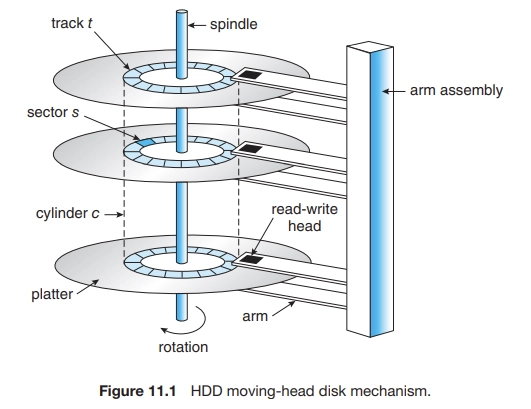
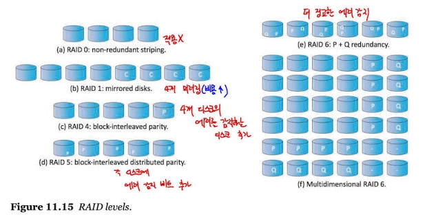

최신 컴퓨터의 기본 대용량 저장장치 시스템은 보조저장장치이며 일반적으로 하드 디스크 드라이브(HDD) 및 비휘발성 메모리(NVM) 장치를 사용하여 제공된다.

<aside>

이 장의 목표

- 다양한 보조저장장치의 물리적 구조와 장치 구조가 활용에 미치는 영향을 설명한다.
- 대용량 저장장치의 성능 특성을 설명한다.
- I/O 스케줄링 알고리즘을 평가한다.
- RAID를 포함하여 대용량 저장장치를 위해 제공되는 운영체제 서비스에 대해 논의한다.
</aside>

## 11.1 대용량 저장장치 구조의 개관(Overview of Mass-Storage Structure)

### 11.1.1 하드 디스크 드라이브(Hard Disk Drives)

- 플래터(platter): CD처럼 생긴 원형 평판 모양. 우리는 정보를 플래터상에 자기적으로 기록하여 저장하고 플래터의 자기 패턴을 감지하여 정보를 읽는다.
- 디스크 암(disk arm): 모든 헤드를 한꺼번에 이동시킨다
- 트랙(track): 플래터의 표면이 논리적으로 나누어져 있는 것.
- 섹터(sector): 트랙이 다시 논리적으로 나누어져 있는것
- 실린더(cylinder): 동일한 암 위치에 있는 트랙의 집합

회전 속도는 전송 속도와 관련이 있다.

디스크 헤드는 공기 또는 헬륨과 같은 다른 가스의 매우 얇은 쿠션 위를 비행하며 헤드가 디스크 표면에 닿을 위험이 있다.헤드가 플래터의 자기 표면을 손상하는 것을 `헤드 충돌`이라 한다.

<aside>

**디스크 전송률**

컴퓨팅의 여러 측면에서와 같이 디스크에 대해 공표된 성능 수치는 실제 성능 수치와 동일하지 않다. 예를 들어, 명시된 전송률은 항상 실질 전송률보다 높다. 전송률은 디스크 헤드가 자기 매체로부터 비트를 읽는 비율일 테지만, 운영체제에 블록이 전달되는 비율과 다르다

</aside>

### 11.1.2 비휘발성 메모리 장치(Nonvolatile Memory Devices)

NVM 장치는 기계식이 아니라 전기식이다.

#### 11.1.2.1 비휘발성 메모리 장치 개요(Overview of nonvolatile Memory Devices)

- SSD(solid-state disk): 플래시 메모리 기반 NVM
- HDD보다 안정성이 높으며 탐색 시간이나 회전 지연시간이 없으므로 더 빠르다.
- 섹터와 유사한 “페이지” 단위로 읽고 쓸 수 있다.

#### 11.1.2.2 NAND 플래시 컨트롤러 알고리즘

NAND 반도체는 한 번 쓴 후에는 덮어쓸 수 없으므로 유효하지 않은 데이터가 포함된 페이지가 있다.

- 사용 가능한 블록이 없으면 개별 페이지에 유효하지 않은 데이터가 있으면 여전히 사용 가능한 공간이 있을 수 있다.
  → 이 경우 가비지 컬렉션이 발생할 수 있다.

### 11.1.3 휘발성 메모리(Volatile Memory)

DRAM이 대용량 저장장치로 자주 사용됨.

RAM 드라이브는 보조저장장치처럼 작동하지만

<aside>

**자기 테이프(Magnetic Tapes)**

자기 테이프는 초기의 보조저장장치 매체로 사용되었다. 자기 테이프에 대한 무작위 접근은 HDD에 대한 무작위 접근보다 약 천 배 정도 느리고, SSD에 대한 무작위 접근보다 십만 배 정도 느리다. 따라서, 자기 테이프는 보조저장장치로는 부적합하다. 테이프는 주로 예비용(backup)이나 자주 사용하지 않는 정보의 저장에 사용하거나, 그리고 한 시스템에서 다른 시스템으로 정보를 전송하기 위한 매체로 사용한다.

</aside>

컴퓨터에는 이미 버퍼링 및 캐싱을 하는데, 임시 데이터 저장장치로 DRAM을 사용하는 목적은 무엇인가?

- DRAM은 휘발성이며 시스템 크래시, 종료 또는 전원이 꺼진 후에는 지속되지 않는다.
- RAM 드라이브를 사용하면 사용자와 프로그래머가 표준 파일 연산을 사용하여 데이터를 메모리에 임시로 보관할 수 있다.

### 11.1.4 보조저장장치 연결 방법(Secondary Storage Connection Methods)

보조저장장치는 시스템 버스 또는 I/O 버스에 의해 컴퓨터에 연결된다.

### 11.1.5 주소 매핑(Address Mapping)

- 저장장치는 논리 블록의 커다란 1차원 배열처럼 주소가 매겨진다.

## 11.2 디스크 스케줄링(Disk Scheduling)

만일 원하는 드라이브와 컨트롤러가 쉬고 있다면 이 요청은 즉시 시작된다. 그러나 드라이브나 컨트롤러가 바쁘면 이 요청은 그 드라이브 큐에 들어가 기다려야 한다.

### 11.2.1 선입 선처리 스케줄링(FCFS Scheduling)

디스크 스케줄링의 가장 간단한 형태.

이 알고리즘은 본질적으로는 공평해 보이지만 빠른 서비스를 제공하지는 못한다. 예를 들어, 다음과 같은 입/출력 요청이 디스크 큐에 와 있다고 생각해 보자.

`98, 183, 37, 122, 14, 124, 65, 67`

만약 122와 124를 함게 서비스해 주고 37과 14 실린더를 그 다음에 함께 처리한다면 헤드의 총 이동 거리를 많이 줄일 수 있고 성능도 향상할 수 있다.

### 11.2.2 SCAN 스케줄링(SCAN Scheduling)

- 디스크 암이 디스크의 한끝에서 시작하여 다른 끝으로 이동하며, 가는 길에 있는 모든 요청을 처리한다. 다른 한쪽 끝에 도달하면 역방향으로 이동하면서 오는 길에 있는 요청을 모두 처리한다. 따라서 헤드는 디스크 양쪽을 계속해서 가로지르며 왕복한다.
- 엘리베이터의 동작과 유사하다고 하여 엘리베이터 알고리즘이라고도 부른다.

### 11.2.3 C-SCAN 스케줄링

- 각 요청에 걸리는 시간을 좀 더 균등하게 하기 위한 SCAN 스케줄링의 변형
- 한쪽 끝에 다다르면 반대 방향으로 헤드를 이동하며 서비스하는 것이 아니라 처음 시작했던 자리로 다시 돌아가서 서비스를 시작한다.

### 11.2.4 디스크 스케줄링 알고리즘의 선택(Selection of a Disk-Scheduling Algorithm)

## 11.3 NVM 스케줄링

## 11.4 오류 감지 및 수정(Error Detection and Correction)

## 11.5 저장장치 관리(Storage Device Management)

### 11.5.1 드라이브 포매팅, 파티션, 볼륨

- 저수준 포매팅(low-level formatting) 또는 물리적 포매팅
    - 각 저장장치 위치마다 특별한 자료구조로 장치를 채운다.
    - 저장장치는 자료를 저장하기 전에 컨트롤러가 읽고 쓸 수 잇도록 섹터들로 나누어져 있어야 한다.

## 11.6 스왑 공간 관리(Swap-Space Management)

- 가상 메모리는 보조저장장치를 메인 메모리의 확장된 공간으로 활용한다
- 스왑 공간은 메모리보다 훨씬 느리므로 성능에 커다란 영향을 미친다.

### 11.6.1 스왑 공간 사용(Swap-Space Use)

- 스왑 공간은 예상보다 크게 잡는 것이 안전하다.
- 그러나 스왑 공간이 너무 크면 파일을 위한 공간이 부족해질 수도 있다.

### 11.6.2 스왑 공간 위치(Swap-Space Location)

- 일반 파일 시스템이 차지하고 있는 공간 안
- 별도의 파티션을 만들어 사용할 수도 있다

## 11.7 저장장치 연결(Storage Attachment)

컴퓨터는 호스트에 연결하는 방식, 네트워크로 연결된 저장장치, 클라우드 저장장치 등의 3가지 방법으로 보조저장장치에 접근한다.

### 11.7.1 호스트 연결 저장장치(Host-Attached Storage)

- 로컬 I/O 포트를 통해 액세스 되는 저장장치
- HDD, NVM, CD, DVD, SAN 등이 적합하다.

### 11.7.2 네트워크 연결 저장장치(Network-Attached Storage)

- NAS는 네트워크를 통해 저장장치에 대한 액세스를 제공

### 11.7.3 클라우드 저장장치(Cloud Storage)

- 네트워크 연결 저장장치와 유사하게 클라우드 저장장치는 네트워크를 통해 저장장치에 액세스 할 수 있다.
- NAS(network-attached storage)와 달리 원격 데이터 센터에 인터넷 또는 다른 WAN을 통해 접속하여 액세스 된다.
- 클라우드 저장장치는 API 기반이며 프로그램은 API를 사용하여 저장장치에 접근한다.
    - Aws S3는 최고의 클라우드 저장장치 제품.

### 11.7.4 SAN(Storage-Area Network)과 저장장치 배열(Storage Arrays)

네트워크에 부착된 저장 시스템의 단점 중 하나가 저장장치의 입출력 연산 시 데이터 네트워크의 대역폭을 소비하는 점이고, 이로 인해 네트워크 통신의 지연을 증가시키는 것이다. 이 문제는 특별히 규모가 큰 클라이언트 서버 구축에 심각한 영향을 준다 — 서버와 클라이언트의 통신이 대역폭의 사용을 위해 다른 서버들과 저장장치 간의 통신과 경쟁하게 된다.

- 여러 호스트와 저장장치가 같은 SAN에 부착될 수 있고, 저장장치는 동적으로 호스트에 할당될 수 있다.

## 11.8 RAID 구조(RAID Structure)

RAID(Redundant Array of Inexpensive Disk)

- 현재는 경제적인 이유보다는 높은 신뢰성과 높은 데이터 전송률 때문에 사용된다.

### 11.8.1 중복으로 신뢰성 향상(Improvement of Reliability via Redundancy)

- 신뢰성의 문제 해결 방안은 `중복`을 허용하는 것
    - 보통 필요하지 않은 정보지만 분실된 정보를 리빌드하기 위하여 오류의 경우마다 사용되는 별도의 정보를 저장한다.

미러링

- 중복을 도입하는 가장 간단한 그러나 비용이 가장 많이 드는 방법
- 모든 드라이브의 복사본을 만드는 것

미러드 볼륨

- 하나의 논리 디스크는 두 개의 물리 드라이브로 구성되고 모든 쓰기 작업은 두 드라이브에 모두에서 실행된다.
- 볼륨 중 하나의 드라이브에 오류가 발생하면, 다른 드라이브로부터 데이터를 읽어 들인다.

### 11.8.2 병렬성을 이용한 성능 향상

데이터 스트라이핑(data striping)

- 여러 드라이브에 각 바이트의 비트를 나누어 저장함으로써 구성
    - 비트 레벨 스타리이핑이라 한다

디스크 시스템에서 병렬성의 두 가지 목적

1. 부하 균등화를 이용하여 여러 작은 액세스의 처리량을 높인다.
2. 규모가 큰 액세스의 응답 시간을 줄인다.

### 11.8.3 RAID 레벨(RAID Levels)

패리티 비트와 디스크 스트라이핑을 결합하여 적은 비용으로 중복을 허용하는 많은 기법이 제안됨.

→ RAID(Redundant Array of Independent Disks) 레벨

- RAID 레벨 0: RAID 레벨 0은 블록 레벨로 스트라이핑하는 드라이브 구성을 말하며 미러링이나 패리티 비트 같은 어떤 중복 정보도 가지고 있지 않는 것을 말한다.
- RAID 레벨 1: RAID 레벨 1은 드라이브 미러링을 사용한다.
- RAID 레벨 4: 드라이브에 걸쳐서 블록을 스트라이핑하여 저장장치 배열에서 직접 사용될 수 있다.
    - i번째 블록은 드라이브 i번에 저장될 수 있다
    - 블록의 오류 수정 계산 결과는 드라이브 n+1에 저장된다
- RAID 레벨 5: 데이터와 패리티를 모든 n+1 드라이브에 분산시킨다.
    - 패리티를 모든 드라이브에 분산시킴으로써 RAID 5는 RAID4에서 발생 가능한 하나의 패리티 드라이브에 대한 과도한 집중을 막을 수 있다
- RAID 레벨 6: RAID 레벨 6은 또한 `P + Q 중복 기법`이라고 불리기도 하는데 이는 RAID 5와 유사하지만, 여러 디스크 오류에 대비하기 위해 추가의 중복 정보를 저장한다.
- 다차원 RAID 레벨 6: 일부 정교한 저장장치 배열은 RAID 레벨 6을 증폭시킨다.
- RAID 레벨 0 + 1과 1 + 0: RAID 레벨 0 + 1은 RAID 0과 RAID 1을 조합한 것이다. RAID 1이 신뢰성을 제공하는 반면에 RAID 0은 높은 성능을 제공한다. 일반적으로 이것은 RAID 5보다 높은 성능을 제공한다.
  RAID 레벨 1 + 0, 드라이브는 쌍으로 미러링된 후 결과 미러링 된 쌍이 스트라이프 된다.

### 11.8.4 RAID 레벨 선택(Selecting a RAID Level)

복구 능력

- 복구 성능은 고장사이의 평균 시간에 영향을 준다.
- 다른 드라이브에 모든 정보를 복사하는 RAID 1이 가장 쉽다.
- 다른 레벨의 RAID는 복구를 위해 모든 드라이브에 접근해야 한다.
    - RAID 5의 복구는 몇 시간이 소요된다.
- RAID 레벨 0은 데이터 손실이 중요하지 않은 고성능 응용 프로그램에 사용된다
    - 데이터 세트가 적재 및 탐색되는 과학적 컴퓨팅
- RAID 레벨 1은 빠른 복구를 통한 높은 안정성이 필요한 응용 프로그램에 널리 사용
- RAID 0 + 1 및 1 + 0은 소규모 데이터베이스와 같이 성능과 안정성이 모두 중요한 경우에 사용
- RAID 5는 보통의 양의 데이터를 저장하는 데 선호된다.
- RAID 6 및 다차원 RAID 6은 저장장치 배열에서 가장 일반적인 형식. 큰 공간 오버헤드 없이 우수한 성능과 보호 기능을 제공

### 11.8.6 RAID의 문제점들(Problems with RAID)

불행하게도 RAID는 운영체제나 사용자를 위해 데이터의 사용을 항상 보장하지 않는다.

- RAID는 물리적 매체의 오류는 보호하지만 다른 하드웨어나 소프트웨어 오류는 보호하지 못한다.

### 11.8.7 객체 저장소(Object Storage)

- 저장장치 풀로 시작하여 해당 풀에 객체를 배치하는 것
- 풀을 탐색하고 해당 객체를 찾을 방법이 없다는 점에서 파일 시스템과 다르다
    - 따라서 객체 지향 저장 방식은 사용자 지향적이 아니라 컴퓨터 지향적이며 프로그램에서 사용하도록 설계되었다.
- 순서
    1. 저장장치 풀 내에 객체를 생성하고 객체 ID를 받는다.
    2. 필요할 때 객체 ID를 통해 객체에 접근한다.
    3. 객체 ID를 통해 객체를 삭제한다.