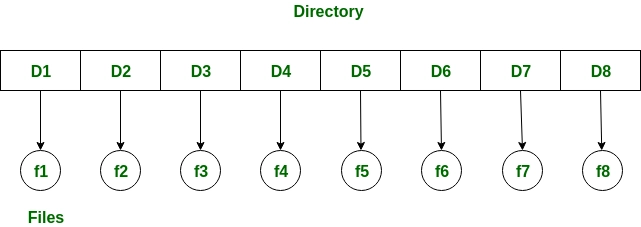
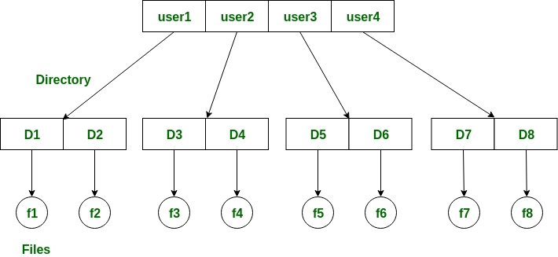
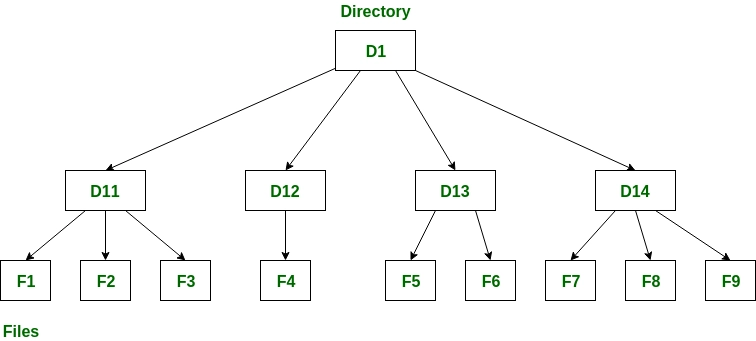
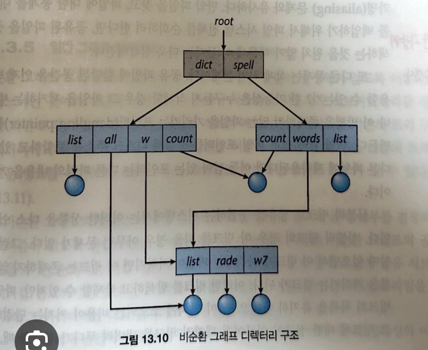
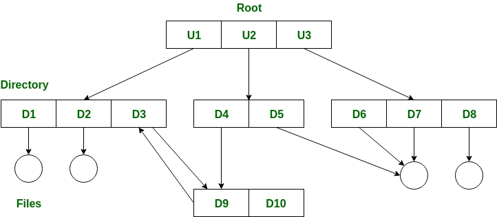

<aside>

이 장의 목표

- 파일 시스템의 기능을 설명한다.
- 파일 시스템 인터페이스의 특징을 기술한다.
- 접근 방법, 파일 공유, 파일 락, 디렉터리 구조를 포함하는 파일 시스템 설계 절충에 관해서 논한다.
- 파일 시스템 보호에 대해서 고려해본다.
</aside>

## 13.1 파일 개념(File Concept)

운영체제는 컴퓨터 시스템을 편리하게 사용하기 위해 저장된 정보에 대한 일관된 논리적 관점을 제공하고 저장장치의 물리적 특성을 추상화하여 논리적 저장 단위, 즉 파일을 정의한다.

- 텍스트 파일: 행들로(그리고 페이지들로) 구성되는 연속된 문자들
- 소스 파일: 함수들의 연속, 각 함수는 선언과 실행문의 순서로 구성
- 실행 파일: 로더가 메모리로 가져와 실행시킬 수 있는 연속된 코드 부분들

### 13.1.1 파일 속성(File Attributes)

- 이름: 기호형 파일의 이름은 사람이 읽을 수 있는 형태로 유지된 유일한 정보다.
- 식별자(identifier): 이 고유의 꼬리표는 통상 하나의 숫자로 파일 시스템 내에서 파일을 확인한다. 식별자는 우리가 읽을 수 없는 파일의 이름이다.
- 유형: 이 정보는 여러 유형을 제공하는 시스템을 위해 필요하다.
- 위치: 이 정보는 파일이 존재하는 장치와 그 장치 내의 위치에 대한 포인터이다.
- 크기: 파일의 현재 크기와 최대 허용 가능한 크기가 이 속성에 포함된다.
- 보호: 접근 제어 정보
- 타임스탬프와 사용자 식별: 이 정보는 생성, 최근 변경, 최근 사용 등을 유지하고, 이들 자료는 보호, 보안 및 사용자 감시를 위해 사용된다.

### 13.1.2 파일 연산(File Operations)

- 파일 생성
    - 파일을 저장할 수 있도록 파일 시스템 내에서 공간을 찾아야 한다.
    - 새로 생성된 파일에 대한 항목이 디렉터리에 만들어져야 한다.
- 파일 열기
    - 모든 파일 연산에서 파일 이름을 지정하게 하면 운영체제가 이름을 검사하고, 접근 권한을 확인하는 등의 작업을 매번 수행해야 한다.
    - 생성과 삭제를 제외한 모든 연산을 하기 전에 반드시 파일 open() 해야한다.
- 파일 쓰기
- 파일 읽기
- 파일 안에서의 위치 재설정
- 파일 삭제
- 파일 절단

몇몇 운영체제는 열린 파일(또는 파일의 섹션)을 락킹(locking)할 수 있는 기능을 제공한다.

*파일 락은 하나의 프로세스가 파일을 잠그고 다른 프로세스들이 그것에 대한 접근하는 것을 막는데 사용될 수 있다.

<aside>

Java에서 파일 락킹(File Locking)

자바 API에서 락(lock)을 획득하는 것은 우선적으로 잠그려 하는 파일에 대한 FileChannel을 얻는 것이다. FileChannel의 lock() 메소드는 락을 획득하는 데 사용된다.

</aside>

### 13.1.3 파일 유형(File Types)

- 파일 이름이 마침표로 구분되는 이름과 확장자 두 부분으로 나뉘게 된다.
- 이들 확장자는 운영체제가 지원하는 것은 아니기 때문에, 이들은 응용 프로그램이 동작하는 파일들에 대한 “힌트”로 생각될 수 있다.

### 13.1.4 파일 구조(File Structure)

### 13.1.5 파일의 내부 구조(Internal File Structure)

내부적으로 한 파일 내의 어떤 위치를 찾는 것은 좀 복잡할 수 있다. 디스크 시스템은 보통 섹터의 크기에 의해 결정되는 블록 크기를 가진다고 하였다. 모든 디스크 I/O는 한 블록 단위로 수행되며 모든 디스크 블록들은 동일한 크기를 가진다. 논리 레코드의 길이는 매우 다양하며 여러 논리 레코드를 하나의 물리 레코드에 팩킹하는 것이 일반적이다.

## 13.2 접근 방법(Access Methods)

파일이 사용될 때는 이 정보가 반드시 접근되어 컴퓨터 메모리로 읽혀야 한다.

### 13.2.1 순차 접근(Sequential Access)

- 가장 간단한 접근 방법
- 저장되어 있는 레코드 순서로 접근

### 13.2.2 직접 접근(Direct Access)

- 직접 접근을 위해 파일은 번호를 갖는 일련의 블록 또는 레코드로 간주한다.
- 직접 접근 파일은 대규모의 정보를 다루는 데 아주 유용, 대규모 데이터베이스가 이런 유형일 수 있다.

모든 운영체제가 직접 접근 파일과 순차 접근 파일을 둘 다 제공하지는 않는다. 어떤 시스템은 순차 접근 파일만 제공하고, 또 다른 시스템은 직접 접근 파일만을 제공한다.

## 13.3 디렉터리 구조(Directory Structure)

디렉터리는 파일 이름을 상응하는 파일 제어 블록으로 바꾸어 주는 심볼 테이블로 볼 수 있다.

디렉터리에 대한 연산

- 파일 찾기
- 파일 생성
- 파일 삭제
- 디렉터리 나열
- 파일의 재명명
- 파일 시스템의 순회

### 13.3.1 1단계 디렉터리(Single-Level Directory)

- 모든 파일이 다 같이 한 개의 디렉터리 밑에 있어 간단하다.

### 13.3.2 2단계 디렉터리(Two-Level Directory)

- 1단계 디렉터리는 다른 사용자들 사이에서의 파일 이름에 대한 혼란을 가져온다.
- 2단계 디렉터리 구조에서는, 각 사용자는 자신만의 UFD 디렉터리를 가지고, UFD는 비슷한 구조로 되어 있지만, 각 디렉터리에는 오직 한 사람의 파일만을 저장한다.
- 사용자 작업이 시작되거나, 시스템에 사용자가 로그인 등을 통해 접속하게 되면 시스템은 마스터 파일 디렉터리를 먼저 탐색한다.

### 13.3.3 트리 구조 디렉터리(Tree-Structured Directory)

- 2단계 디렉터리 구조를 2단계 트리로 보는 방법처럼 여러 단계로 확장하는 일반적인 방법
- 이것은 일반 사용자들에게 자신의 서브디렉터리를 얼마든지 만들 수 있게 해준다
- 디렉터리는 그 하부에 다시 디렉터리나 파일을 가질 수 있다.
- 통상적으로 각 프로세스는 현재 디렉터리(current directory)를 가지고 있다.
  - 현재 디렉터리 안에는 사용자가 현재 관심이 있는 대부분의 파일이 들어 있을 것이다.

### 13.3.4 비순환 그래프 디렉터리(Acyclic-Graph Directories)

- 비순환 그래프는 디렉터리들이 서브디렉터리들과 파일들을 공유할 수 있도록 허용하는 구조
- 팀을 이루어 작업을 할 때, 공유되어야 할 모든 파일은 하나의 디렉터리에 놓일 수 있다.

### 13.3.5 일반 그래프 디렉터리(General Graph Directory)

## 13.4 보호(Protection)

정보가 컴퓨터 시스템에 저장되어 있을 때 신뢰성, 부적절한 접근으로부터 안전하길 원한다.

### 13.4.1 접근의 유형(Types of Access)

보호 기법은 가능한 파일 접근 유형을 제한함으로써 통제된 접근을 제공한다.

- 읽기: 파일로부터 읽기
- 쓰기: 파일에 쓰기
- 실행: 파일을 메모리에 읽어오고 실행하기
- 추가: 파일의 끝에 새로운 정보를 첨부하기
- 삭제: 파일을 지우고 사용공간을 반납하기
- 리스트: 파일의 속성, 이름 등을 출력하기
- 속성 변경: 파일의 속성 변경하기

### 13.4.2 접근 제어(Access Control)

- 가장 일반적인 방법은 사용자의 신원에 따라 특정 파일에 대한 접근 허용 여부를 결정
  - 신원에 기반한 접근을 구현하는 가장 일반적인 방법은 각 파일과 디렉터리에 접근 제어 리스트(Acess-Control List, ACL)를 연관해 두는 것.

접근 리스트의 길이를 간결하게 하기 위하여 많은 시스템은 모든 사용자를 세 가지 부류로 분류한다.

- 소유자: 파일을 생성한 사용자가 소유자이다.
- 그룹: 파일을 공유하여 파일에 대한 유사한 접근을 해야 하는 사용자들의 집합
- 기타: 시스템에 있는 모든 다른 사용자들

### 13.4.3 다른 보호 방법

- 암호
  - 암호가 무작위로 선택되고 자주 변경된다면 이 기법은 파일 접근을 암호를 알고 있는 사람으로 제한하는 데 효과적.
  - 파일마다 알아야할 암호가 너무 많아진다.

## 13.5 메모리 사상 파일(Memory-Mapped Files)

- 메모리 사상
  - 프로세스의 가상 주소 공간 중 일부를 관련된 파일에 할애하는 것
  - 현저하게 성능을 향상한다.

### 13.5.1 기본 기법

- 파일의 메모리 사상은 프로세스의 페이지 중 일부분을 디스크에 있는 파일의 블록에 사상함으로써 이루어진다.
- 파일 내용 중 페이지 크기만큼의 해당 부분이 파일 시스템으로부터 메모리 페이지로 읽혀 들어오게 된다.
  이후 파일 read/write는 일반적인 메모리 액세스와 같이 처리된다.